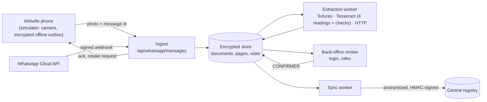

# MaternalData-Automation — DayOne (CodeML)

Platform that turns **photos of paper maternal registries** into structured digital records, **tracks each woman across visits**, and routes uncertain extractions to **back-office review**.

**Midwives only send documents** on WhatsApp; they do not manage patients or verify fields in chat. The browser simulates the midwife's phone (with a camera and an offline mode); a WhatsApp Cloud API adapter is ready but has not been connected to a live Meta account (see [Simulator vs. real integration](#simulator-vs-real-integration)). Extraction is either hand-written fixtures (stable demo) or local Tesseract OCR of the specimen booklets.

**Challenge:** *Une sage-femme, un téléphone et une IA* / *The Offline Midwife* (Challenge ID **17**).

## Operating model

| Role | What they do |
|------|----------------|
| Midwife | Send registry photo(s) → receive short ack |
| Platform | Extract, link visits, maintain patient timeline |
| Back-office | Confirm/correct fields & patient matches when AI is unsure |

Details: [docs/operating-model.md](./docs/operating-model.md) (fiche photos only—no ID cards)

## Team

| Person | Area |
|--------|------|
| **Fatma** | AI / extraction (+ linking fields from paper) |
| **Aymane** | WhatsApp ingest + back-office review UI |
| **Ariyan** | Backend, patient registry, sync, privacy |

**Work plan:** [tasks.md](./tasks.md)

## Key documents

| File | Purpose |
|------|---------|
| [consignes-fr-en.pdf](./consignes-fr-en.pdf) | Official instructions & grading (FR + EN) |
| [Extra Info CodeML Hackathon.docx](./Extra%20Info%20CodeML%20Hackathon.docx) | Architecture notes, V1 scope |
| [manifest.json](./manifest.json) | Dataset file list and checksums |

## Data (read-only)

- `data/Paper Registry/` — specimen booklets (`dossiers_specimen_10_patientes-*.png`, 10 fictitious patients × 8 pages) and the specimen PDF; the five real fiche photos `1-1.jpg`…`1-5.jpg` were removed on this branch
- `data/maternal_registry_synthetic.csv` / `.xlsx` — 200-row synthetic reference table  

Do not modify original images or ground-truth files per consignes.

## Run

Python 3.11+ with two packages (`pip install -r requirements.txt` installs `cryptography` and `Pillow`; the
PaddleOCR lines apply to Python 3.12 only).

```sh
python3 -m dayone                    # http://127.0.0.1:8000, fixture extraction, demo seed
python3 -m dayone --port 8765 --window 8 --db var/dayone.sqlite3
python3 -m unittest discover -s tests -v
```

**First start:** the console prints a one-time password for the `admin` account. Sign in with it, then create
named accounts (`python3 -m dayone --add-user amina --role reviewer`, prompts for a password of 10+ characters).
Reviewers review, confirm and request retakes; admins can also reset the demo, flip the AI / central-registry
switches, and register users and WhatsApp numbers.

The database is created in `var/` and seeded with one patient (`PAT-000001`, the first 3 visits of specimen
patient 1). It is **encrypted at rest** (AES-256-GCM): set `DAYONE_DATA_KEY` (32 bytes, URL-safe base64) in
production; without it a key file `var/dayone.key` (owner-only) is created next to the data, which is fine for
development only. An older plain database is converted on first start.

HTTPS: `python3 -m dayone --tls-cert cert.pem --tls-key key.pem` (Secure cookies and HSTS). For a local test
certificate: `openssl req -x509 -newkey rsa:2048 -nodes -days 30 -subj /CN=localhost -keyout key.pem -out cert.pem`.

### Local OCR on the specimen pages (Tesseract)

Install Tesseract with French language data (macOS: `brew install tesseract tesseract-lang`) and Pillow
(`pip install -r requirements.txt`), then run:

```sh
python3 -m dayone --extractor tesseract --port 8001 --db var/dayone-tesseract.sqlite3
```

The OCR reads **only** the specimen pictures `data/Paper Registry/dossiers_specimen_*`. Any other image fails
extraction with `NOT_A_SPECIMEN_PAGE` and goes to manual entry. Send the eight pages of one booklet together
(patient 1 is pages 01–08, patient 2 is 09–16, and so on).

How it reads (`dayone/specimen_ocr.py`):

- Pages are recognised by their printed title, not their file name. The cover gives the file number and the
  facility, the "Grossesse actuelle" page gives the DDR and the visit grid. Pages from two booklets in one
  document fail with `SEVERAL_BOOKLETS` so the reviewer can split them.
- Every grid column with a visit date becomes a visit (slots `T1_V1` … `M9`). Rows are anchored on their printed
  labels; blank cells and dashes become `NOT_PROVIDED` from the pixels, before any OCR.
- Each value is read four times (page in French, page in English, cell crop with and without a character
  whitelist). It is `KNOWN` only if at least three readings agree and none disagrees, **and** it is consistent
  with the booklet: gestational age against DDR and visit date, visit dates in order, plausible weight change
  between visits, fundal height against a confirmed gestational age. Confidence is the share of agreeing readings.
- Everything else goes to review with the best candidate and a flag saying why. Checks only demote values; nothing
  is inferred from other fields.

Accuracy on the 10 specimen patients (`python3 eval/compare_ocr.py --markdown`, about 2.4 s per patient on a laptop):

| field | KNOWN, right | FALSE-KNOWN | review | review (blank cell) | empty, right | missed | right value suggested |
|---|---:|---:|---:|---:|---:|---:|---:|
| registry_file_number | 0 | 0 | 10 | 0 | 0 | 0 | 2 |
| midwife_patient_code | 0 | 0 | 0 | 0 | 10 | 0 | 0 |
| facility_name | 1 | 0 | 9 | 0 | 0 | 0 | 2 |
| last_menstrual_period | 5 | 0 | 5 | 0 | 0 | 0 | 0 |
| visit_date | 24 | 0 | 31 | 0 | 0 | 0 | 15 |
| gestational_age_days | 20 | 0 | 35 | 0 | 0 | 0 | 10 |
| weight_kg | 17 | 0 | 38 | 0 | 0 | 0 | 15 |
| systolic_bp_mmhg | 15 | 0 | 40 | 0 | 0 | 0 | 10 |
| diastolic_bp_mmhg | 15 | 0 | 40 | 0 | 0 | 0 | 14 |
| fundal_height_cm | 12 | 0 | 32 | 0 | 11 | 0 | 20 |
| syphilis_test | 7 | 0 | 3 | 3 | 42 | 0 | 2 |
| hiv_test | 4 | 0 | 6 | 8 | 37 | 0 | 6 |
| **total** | **120** | **0** | **249** | **11** | **100** | **0** | **96** |

Of 369 values written on the pages, 120 (33 %) come out `KNOWN` and right, none comes out `KNOWN` and wrong, and none
is missed; the reviewer confirms or corrects the rest, with the right value already suggested for 96 of them.

Limits, stated plainly:

- The ground truth (`eval/ground_truth.json`) was transcribed by eye and is **not verified by a person yet**. The
  agreement thresholds and consistency tolerances were chosen on these same 10 patients; there is no held-out set.
- Handwriting styles vary per patient; Tesseract reads some of them poorly (patients 2, 3, 7 and 10 mostly go to
  review). Real phone photos (perspective, blur, Arabic handwriting) are not handled: the layout is the fixed
  specimen scan.
- Ticked boxes (facility type, blood group) are not read; `eval/mark_detection_demo.py` is a prototype only.

PaddleOCR remains available for comparison with `--extractor paddleocr` (Python 3.12 and the pinned
dependencies, `.venv-paddle312`). On patient 1 it took about 52 s and 7 GB of RAM for three pages.

### Demo script

Sign in as `admin` first.

1. **Midwife (simulated phone on the left):** select specimen pages `…-01.png`, `…-02.png` and `…-03.png`, then press **Envoyer**. Each page gets an acknowledgment, and the document appears in the queue as a provisional group.
2. Wait about 8 s (the grouping window). The fixture extractor produces a draft with 6 visits and **2 uncertain fields**.
3. **Back-office:** answer the questions:
   - Hauteur utérine (8e mois) is illegible ("3?"). Click **Corriger** and enter `31`.
   - Date of the 9th-month visit was read as "1?/01/2026" at 42 % confidence. Click **Corriger** and enter `18/01/2026`, which matches 38 SA from the DDR.
4. **Patient:** `PAT-000001` is *suggested* because the file number matches. Click it to select. Nothing is saved yet.
5. **CONFIRMER l'enregistrement:** the first three visits are already registered (unchanged), three new visits are created, and the timeline shows 6 visits. A moment later the document shows **Synchronisé** (central registry receipt).
6. **Offline capture:** untick **Réseau** on the phone, select a page (tick *afficher les autres images*) and press **Envoyer**, or press **Caméra** and take a photo. The photos wait on the phone, encrypted, with a "⏱ en attente du réseau" bubble. Tick **Réseau** again: they are sent in capture order, and each page shows when it was taken and when it was received.
7. **Retake:** on any page of an open document, press **Reprendre la photo**. The phone receives *« Merci de reprendre la photo de la page N »*, the document waits (`Photo à reprendre`), and the next photo sent from the phone replaces that page.
8. Optional checks:
   - **Rejouer le dernier webhook** is ignored as a duplicate.
   - Untick **IA disponible** and send photos: they wait in `PENDING_AI` (manual entry is offered) until it is ticked again.
   - Untick **Registre central disponible** and register a document: it shows `Synchro en échec` with automatic retries, and becomes `Synchronisé` when ticked again.
   - **Déplacer… → nouveau dossier** splits a page into its own document.
   - Camera photos are not OCR'd: with `--extractor tesseract` they fail as `NOT_A_SPECIMEN_PAGE` and go to **Saisie manuelle**, where **Ajouter une visite** adds grid columns.

### Configuration

| Variable | Purpose |
|---|---|
| `DAYONE_DATA_KEY` | 32-byte data key (URL-safe base64) for encryption at rest; keep it outside `var/` |
| `DAYONE_CENTRAL_URL`, `DAYONE_CENTRAL_SECRET` | central registry endpoint and HMAC secret; without them an encrypted local file stands in |
| `DAYONE_EXTRACTOR_URL`, `DAYONE_EXTRACTOR_TOKEN` | external model service for `--extractor http` |
| `WHATSAPP_APP_SECRET`, `WHATSAPP_VERIFY_TOKEN`, `WHATSAPP_ACCESS_TOKEN`, `WHATSAPP_PHONE_NUMBER_ID`, `WHATSAPP_GRAPH_URL` | WhatsApp Cloud API adapter (webhook `/webhook/whatsapp`); unset = simulator only |

Media retention: `python3 -m dayone --purge-media 90` deletes uploaded photos once all their documents were
synced more than 90 days ago. Anonymized export for a dashboard: `/export/visits.csv` (admin). Full API:
[docs/api-integration.md](./docs/api-integration.md).

### Architecture



### Code map

| Path | Owner | Content |
|------|-------|---------|
| `docs/schema.md`, `docs/identity-strategy.md`, `docs/api-integration.md` | all | Contracts (fields, statuses, IDs, linking, API) |
| `fixtures/*.json`, `dayone/extraction.py`, `dayone/schema.py` | Fatma | Fixtures, extractor interface (fixture, HTTP), draft validator |
| `dayone/live_ocr.py`, `dayone/specimen_ocr.py`, `eval/` | Fatma | Tesseract extractor, specimen layout and agreement rules, evaluation and ground truth |
| `dayone/store.py`, `dayone/service.py`, `dayone/linking.py`, `dayone/sync.py` | Ariyan | Encrypted storage, lifecycle, review/confirm/timeline, retake, central sync |
| `dayone/crypto.py`, `dayone/auth.py`, `dayone/media.py` | Ariyan | Encryption at rest, accounts and sessions, encrypted photo store |
| `dayone/server.py`, `dayone/whatsapp.py`, `dayone/static/` | Aymane | HTTP API, WhatsApp Cloud API adapter, simulated phone and back-office screen |
| `tests/` | all | Schema, OCR, flow, HTTP/auth, media/retake, sync, WhatsApp, export |
| `.github/workflows/ci.yml` | all | Tests, whitespace and OCR evaluation on every push |

### Simulator vs. real integration

| Part | Simulator (demo) | Real integration |
|------|------------------|------------------|
| WhatsApp inbound | Browser phone posts `{sender_id, message_id, media_ref, captured_at}`; dataset pages or camera photos (`POST /api/media`) | `dayone/whatsapp.py`: signed webhook, Graph API media download, encrypted storage. Tested with a fake Graph API; not connected to a live Meta account |
| WhatsApp outbound | Acknowledgments and retake requests shown in the simulated thread | Same messages queued and sent through the Cloud API with retries |
| Offline phone | Encrypted IndexedDB outbox in the browser, sent on reconnection | WhatsApp's own outbox (not ours) |
| Senders | One seeded demo number mapped to *C/S Sidi Smail* | Admins register numbers per facility (`POST /api/senders`) |
| Extraction | Fixtures, or local Tesseract on the specimen pages | `--extractor http` for an external model service |
| Central registry | Encrypted local file, with an availability switch | `DAYONE_CENTRAL_URL` (HMAC-signed, idempotent) |

### Open blockers and limitations

Tracked in [tasks.md](./tasks.md#blockers-and-open-gaps-keep-visible-until-resolved).

- **Organizer confirmation (not obtained).** Verification is done by back-office staff, not the midwife, but the official instructions say "verified by the midwife". This deviation rests on verbal guidance and still needs written confirmation, as does the simulated phone outbox standing in for on-device storage. See [docs/operating-model.md](./docs/operating-model.md).
- **WhatsApp not live.** The Cloud API adapter needs a Meta app, a business number and HTTPS on a public address; only the simulator has been used end to end.
- **OCR scope.** Only the specimen booklets are read, by design. Ground truth is unverified, handwriting styles vary, ticked boxes are not read, and real phone photos (perspective, blur) are not handled.
- **Keys.** Without `DAYONE_DATA_KEY` the data key sits next to the data (development only). There is no key rotation yet.
- **Single process.** The encrypted database is held in memory and rewritten after each commit; fine for a facility-sized registry, not for a large multi-server deployment.
