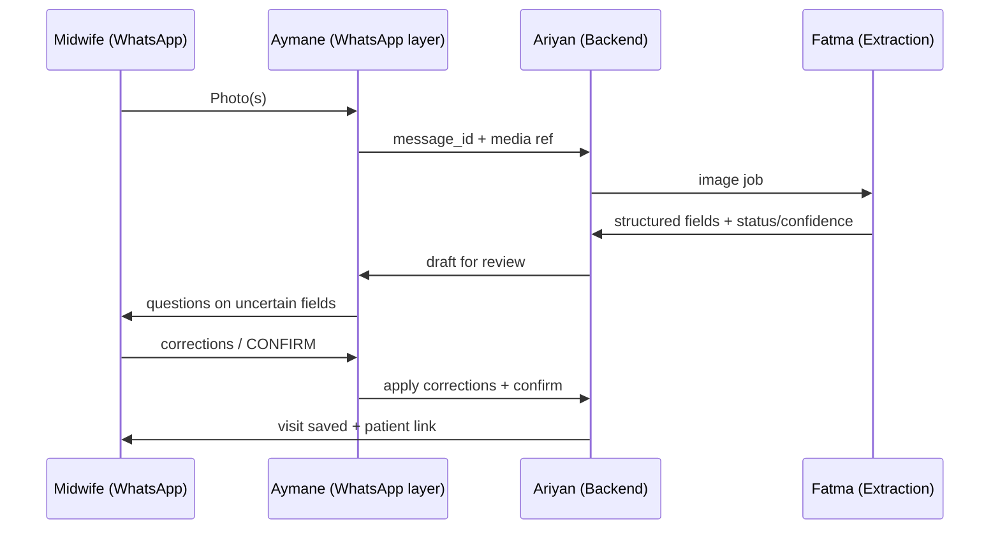

# DayOne — The Offline Midwife

**Team:** Fatma · Aymane · Ariyan  
**Challenge:** Turn paper maternal registry photos into structured, verified, visit-linked digital records via a WhatsApp-style agent.  
**References:** `consignes-fr-en.pdf` (authoritative rules), `Extra Info CodeML Hackathon.docx` (architecture & V1 scope), `manifest.json`, `data/Paper Registry/`, `data/maternal_registry_synthetic.csv` / `.xlsx`, recommended plan: `DayOne_Three_Person_Task_Plan.pdf`

**Out of scope:** Clinical prediction, triage, diagnosis, treatment recommendations.

---

## What judges care about (100 pts)

| Criterion | Points | Primary owner |
|-----------|--------|----------------|
| Extraction quality (field accuracy on test set) | 30 | **Fatma** |
| Uncertainty (status + confidence, agent shows doubt) | 20 | **Fatma** + **Aymane** |
| Conversational review (Confirm / Edit / Retake, follow-ups, multipage) | 20 | **Aymane** |
| Offline robustness (queue, states, sync after reconnect) | 15 | **Ariyan** (+ **Aymane** for UX) |
| Patient linking + privacy (code-based link, no direct IDs stored) | 10 | **Ariyan** |
| Code quality + README | 5 | **All** |

---

## Team ownership

| Person | Role | Main deliverable |
|--------|------|------------------|
| **Fatma** | AI / document extraction | Image → structured JSON with per-field **status** and **confidence** |
| **Aymane** | WhatsApp / conversation | Real or simulated WhatsApp: photo upload, review, correction, confirmation |
| **Ariyan** | Backend / records / sync / privacy | Durable records, lifecycle states, visit linking, idempotency, encryption |

---

## Core user flow

1. Midwife sends registry photo(s) on WhatsApp.
2. Webhook receives message; backend stores media and enqueues work.
3. Extraction returns structured fields with status and confidence.
4. Bot guides review: **Confirm / Corriger / Reprendre la photo** (+ manual entry if AI down).
5. Backend saves **validated** visit after explicit confirmation.
6. Next visit: link via **midwife-assigned code on the registry**; midwife chooses among suggested matches.

### Two-layer architecture (from Extra Info + consignes)

| Layer | Requires internet | Responsibilities |
|-------|-------------------|------------------|
| **Layer 1 — Offline client** | No | Login/session, camera, image QA, encrypted local store, manual entry/edit, local patient cache, **queue** (`PENDING_AI`), continue working offline |
| **Layer 2 — Online services** | Yes | Upload queue, **Fatma** extraction/OCR, **Ariyan** DB sync & central duplicate search, backup, admin |

Offline capture must **never** be lost when connectivity drops. AI and cloud sync run when the network returns; review can happen on-device or via WhatsApp depending on your prototype shape.

> **Privacy:** `Extra Info CodeML Hackathon.docx` uses example fields like name/CIN/phone for illustration. **`consignes-fr-en.pdf` overrides:** do not collect or store direct identifiers from paper; use internal IDs + **midwife-written patient code** on the registry for linking.



---

## Agree before coding (all three — Day 0)

- [ ] **One document layout** to support first (e.g. Moroccan *Fiche de surveillance* header + 1–2 follow-on sections from `data/Paper Registry/1-*.jpg` or specimen PNGs).
- [ ] **10–20 fields** for MVP (expand later). Map to CSV columns where useful for evaluation (`data/maternal_registry_synthetic.csv`).
- [ ] **Shared JSON schema** + OpenAPI or short `docs/schema.md` (field names, units, enums).
- [ ] **Field status enum** (from consignes): `KNOWN`, `UNKNOWN`, `NOT_PROVIDED`, `ILLEGIBLE`, `NOT_APPLICABLE`, `NEEDS_REVIEW` — distinct from **human verification** (`human_verified`, verifier, correction history).
- [ ] **Record lifecycle** states: `CAPTURED` → `PENDING_AI` → `AI_PROCESSED` → `NEEDS_REVIEW` → `VALIDATED` → `PATIENT_MATCHED` → `REGISTERED` → `SYNCED` (+ failure: processing, sync, duplicate suspected, manual review).
- [ ] **Patient linking:** internal IDs generated server-side; link visits using **midwife code on paper** (not name). Match UI: `[Patiente 1] [Patiente 2] [Aucune, créer] [Je ne sais pas]` — never auto-merge on name alone.
- [ ] **Privacy:** no collection/storage of names, phone, national ID, address from forms; redact or ignore on extraction; encrypted local queue; no PHI in logs; synthetic data only for third-party models unless approved.
- [ ] **Offline strategy:** consignes require **offline-first** (encrypted local capture + queue). Cloud WhatsApp alone is not full offline — decide: (A) companion local capture app/simulator + sync, or (B) document simulated offline in demo + real WhatsApp when online. Align with organizers if unclear.

### MVP field shortlist (draft — finalize on Day 0)

Administrative (non-PII): `registry_file_number`, `region`, `province`, `facility_name`, `facility_type`, `coverage_mode`, `midwife_patient_code`  
Clinical (examples): `age_years`, `gravidity`, `parity`, `gestational_age_weeks`, `systolic_bp_mmhg`, `diastolic_bp_mmhg`, `hiv_test`, `syphilis_test`, `hepatitis_c_test`, `delivery_mode`, `newborn_sex`, `birth_weight_g`, `visit_date`  
*Do not extract or store patient name fields (often masked on specimens).*

### Registry sections to map (Cuadernito / fiche — extend after MVP)

Use `data/Paper Registry/dossiers_specimen_10_patientes.pdf` and specimen PNGs for full booklet layout. **Fatma** owns the field map in `docs/field-mapping.md`:

1. Patient / administrative (non-PII only per consignes)  
2. Medical & family history  
3. Obstetric history  
4. Current pregnancy (longitudinal antenatal rows)  
5. Delivery  
6. Postpartum & newborn  

Multipage rule (Extra Info §D): one digitization session → many pages → **one document** → process as a whole. Re-photo of same booklet → show existing record; midwife chooses what to update (consignes §7).

### Open questions — resolve in Day 0 standup

| # | Question | Default for hackathon build |
|---|----------|-----------------------------|
| A | Primary match key on paper? | **`midwife_patient_code`** + registry file number; **not** CIN/name (consignes) |
| B | No code on page? | Create provisional internal patient; midwife confirms at match step |
| C | Midwife visibility scope? | At least “own captures”; document if facility-wide |
| D | Multipage in one session? | **Yes** — Aymane state `capturing_pages` until “terminé” |
| E | Re-digitize same booklet? | **Show existing + selective update** (Ariyan) |
| F | UI language? | French bot messages minimum; preserve `raw_text` from form |
| G | AI unavailable? | Manual entry path in chatbot (Aymane + Ariyan) |
| H | Follow-up questions? | **Yes** — required for `NEEDS_REVIEW` / `ILLEGIBLE` fields |

Internal display IDs (e.g. `PAT-000001`) are fine if **auto-generated**, never derived from name (Extra Info §8).

### Minimum shared record contract (illustrative)

```json
{
  "internal_patient_id": "uuid-generated",
  "visit_id": "uuid-generated",
  "source_message_id": "whatsapp-message-id",
  "midwife_patient_code": "SF-XXXX",
  "record_status": "NEEDS_REVIEW",
  "lifecycle": "AI_PROCESSED",
  "visit_date": "2026-10-03",
  "fields": {
    "gestational_age_weeks": {
      "raw_text": "38 sem",
      "value": 38,
      "unit": "weeks",
      "confidence": 0.68,
      "field_status": "NEEDS_REVIEW",
      "human_verified": false,
      "validation_flags": [],
      "corrections": []
    }
  },
  "original_image_ref": "encrypted-blob-id",
  "capture_metadata": {
    "captured_at": "ISO-8601",
    "midwife_id": "authenticated-id"
  }
}
```

---

## Milestones (whole team)

| Stage | Goal | Acceptance |
|-------|------|------------|
| **1. Contract & setup** | Same JSON fixture; one WhatsApp message hits webhook | All three run stack locally; `fixtures/sample_extraction.json` committed |
| **2. Core MVP** | Photo → extract → review → **explicit CONFIRM** → saved visit | End-to-end on 1 specimen image |
| **3. Reliability** | Bad photos, missing fields, corrections, duplicate webhooks | Idempotent saves; no duplicate visits |
| **4. Challenge depth** | Multipage session, patient match, offline queue + sync demo | Meets consignes sections 5–8 |
| **5. Submission** | README, architecture, extraction metrics, demo script | Ready for jury |

---

## Fatma — AI / document extraction

### Goals

- Schema-driven extraction (not generic OCR dump).
- Per-field **status** + **confidence**; null/absent when illegible — **never invent** clinical values.
- Evaluation on held-out images vs CSV/reference where available.

### Task checklist

- [ ] Inspect `data/Paper Registry/` and PDF; document field → schema mapping in `docs/field-mapping.md`.
- [ ] Implement extraction service (HTTP or library callable by Ariyan’s worker): input image → output agreed JSON.
- [ ] Preprocessing only where it helps: crop, deskew, contrast (test on blurred/degraded PNGs).
- [ ] OCR and/or vision model; preserve `raw_text` + normalized `value` + `unit`.
- [ ] **PII policy in pipeline:** strip/ignore name, spouse, ID, phone, address; flag if detected.
- [ ] Plausibility checks (ranges, units); set `NEEDS_REVIEW` / flags instead of silent fixes.
- [ ] Separate **extraction status** from **human_verified** (high confidence ≠ confirmed).
- [ ] Image quality gate: reject unreadable captures with clear reason → triggers “Reprendre la photo” path.
- [ ] Test set: mix of `1-*.jpg`, specimen PNGs, multipage sequences; report accuracy, missing-field recall, false “KNOWN”.
- [ ] Deliver `fixtures/` (success, partial, illegible, PII-heavy redacted) for Aymane/Ariyan offline dev.
- [ ] Wire to Ariyan’s `PENDING_AI` job handler; stable schema version in response.

### Handoff

| Deliverable | Ready when |
|-------------|------------|
| `POST /extract` (or equivalent) | Same sample image → identical schema every run |
| Fixtures + eval notebook/script | Team can cite field-level metrics for README |
| Failure catalog | Documented behaviors for blur, empty checkbox, Arabic snippets |

**Done when:** Uncertain/missing fields always arrive as `NEEDS_REVIEW` / `ILLEGIBLE` / `NOT_PROVIDED`, never as silent `KNOWN`.

---

## Aymane — WhatsApp integration / conversation

### Goals

- WhatsApp Business Cloud API (bonus) or faithful simulator with same webhook shape.
- Conversational review aligned with consignes: confirm, edit, retake, manual entry, multipage.

### Task checklist

- [ ] Meta Cloud API: test number, webhook HTTPS, signature verification; secrets in env only.
- [ ] Inbound: photos + text; pass `message_id` and media IDs to Ariyan immediately (idempotency).
- [ ] Outbound: ack (“received”), then field-by-field review in **plain French** (English optional bonus).
- [ ] Conversation state machine per sender: `idle` → `capturing_pages` → `reviewing` → `matching_patient` → `confirmed`.
- [ ] One clear question at a time for `NEEDS_REVIEW` / `ILLEGIBLE` fields; support **Confirmer / Corriger / Reprendre / Passer / Annuler**.
- [ ] On correction: validate format, echo back, then continue.
- [ ] Full summary + require **CONFIRM** (or equivalent) before Ariyan commits `VALIDATED`.
- [ ] Multipage: “Envoyer la page suivante” until midwife says done → single document in backend.
- [ ] Retake flow: new photo replaces or adds per midwife choice (coordinate with Ariyan).
- [ ] Patient match prompts when Ariyan returns candidates: numbered options + create new + unsure.
- [ ] Error handling: API down → offer manual field entry path; duplicate webhook → no restart of review.
- [ ] Do not send “saved” until Ariyan returns committed `visit_id`.

### Example dialogue (French)

| Speaker | Message |
|---------|---------|
| Sage-femme | *[Photo registre]* |
| Bot | J’ai extrait 14 champs. 2 à revoir. Âge gestationnel : 38 sem. Confirmer ou corriger ? |
| Sage-femme | Corriger : 39 sem |
| Bot | Mis à jour : 39 sem. Prochain champ : poids du nouveau-né ? |
| Bot | Récapitulatif. Répondez **CONFIRMER** pour enregistrer la visite. |
| Sage-femme | CONFIRMER |
| Bot | Visite enregistrée. Code patient interne …, visite V003. |

**Done when:** Real WhatsApp photo → questions → correction → committed visit ID; replayed webhook does not duplicate session.

---

## Ariyan — Backend / records / sync / privacy

### Goals

- System of record: patients (internal IDs), visits, drafts, images, conversation audit.
- Offline-first queue, encryption, lifecycle, linking, idempotency.

### Task checklist

- [ ] Data model: `Patient`, `Visit`, `Document` (multipage), `FieldValue`, `ConversationSession`, `Job`, `MediaBlob`.
- [ ] API for Aymane: ingest message, get draft, patch field corrections, confirm visit, list match candidates.
- [ ] API for Fatma: dequeue image jobs, post extraction result, update lifecycle to `AI_PROCESSED`.
- [ ] Persist raw + normalized values, confidence, field_status, validation_flags, correction history, verifier + timestamp.
- [ ] Store original images encrypted at rest; link to record ID, capture time, midwife ID, processing status; role-restricted download.
- [ ] Patient linking service: match on `midwife_patient_code` + optional weak signals; return ranked candidates; never auto-create when plausible match exists.
- [ ] Idempotency: WhatsApp `message_id`, job IDs, confirm tokens → no duplicate visits on retry.
- [ ] Transactional confirm: `VALIDATED` + `REGISTERED` then trigger outbound notification job.
- [ ] Offline queue module: `CAPTURED` / `PENDING_AI` while offline; sync worker on reconnect; state machine tests.
- [ ] Local encrypted store spec (mobile/simulator): what gets queued before sync — document for README.
- [ ] Security: HTTPS, auth on admin APIs, no PII in logs, retention policy for temp files, env-based keys.
- [ ] Export: anonymized JSON/CSV for demo dashboard (optional bonus).
- [ ] Re-digitization: if same registry photographed again, surface existing document; midwife picks fields to update.

### Offline / recovery matrix

| Situation | Expected behavior |
|-----------|-------------------|
| Phone offline | Messages queue on device (or simulated); nothing lost; sync on reconnect |
| WhatsApp cloud unreachable | Inbound delayed; process when delivered; show “en attente” state |
| Backend restart | Jobs resume; drafts intact |
| Worker crash mid-extract | Retry job; stay `PENDING_AI` or fail visibly |
| Duplicate webhook | Same `message_id` → single visit |

**Done when:** Replay webhook + restart worker + retry confirm → **one** visit, corrections preserved.

---

## Shared integration tasks

- [ ] Monorepo layout agreed (e.g. `services/extraction`, `services/api`, `services/whatsapp-bot`, `packages/schema`).
- [ ] CI: lint + schema validation on fixtures.
- [ ] README: install, env vars, demo steps, architecture diagram, offline limitations.
- [ ] Demo script (10–15 min):
  1. **Visit 1:** photo → 2 uncertain fields → 1 correction → CONFIRM → saved.
  2. **Visit 2:** second photo → patient match choice → two visits on same profile.
  3. **Offline:** capture while “offline” → reconnect → processing completes.
  4. **Recovery:** replay webhook → no duplicate.
  5. *(Optional)* multipage registry + retake photo.

---

## Evaluation prep (Fatma leads, all contribute)

- [ ] Hold-out image set with manual ground truth (10+ pages).
- [ ] Table: field accuracy, status correctness, confidence calibration notes.
- [ ] README “Known limitations” (Arabic handwriting, checkboxes, etc.).

---

## Repo assets (do not modify originals)

| Asset | Use |
|-------|-----|
| `consignes-fr-en.pdf` | Full rules, statuses, lifecycle, grading (**source of truth**) |
| `Extra Info CodeML Hackathon.docx` | Two-layer offline/online design, V1 scope, workflow Q&A |
| `data/Paper Registry/*` | Specimen images + `dossiers_specimen_10_patientes.pdf` (10 patients); `1-1.jpg`…`1-5.jpg` sample fiche |
| `data/maternal_registry_synthetic.csv` | Ground-truth-style table, **200 rows** (+ header) |
| `data/maternal_registry_synthetic.xlsx` | Same dataset as CSV (prefer one in scripts; keep both read-only) |
| `manifest.json` | **132** listed files with SHA-256 — do not modify listed assets |
| `tasks.md` | Team backlog (Fatma / Aymane / Ariyan) |

---

## Quick links

- [WhatsApp Cloud API docs](https://developers.facebook.com/docs/whatsapp/cloud-api)
- [Meta WhatsApp API examples](https://github.com/fbsamples/whatsapp-api-examples)
- Dataset folder (organizers): [Google Drive](https://drive.google.com/drive/folders/1RtBBVDkPFfMiouPEry2Ogzu26Odh8JUF?usp=sharing)

---

*Last updated: includes repo dataset + `Extra Info CodeML Hackathon.docx`; privacy rules from `consignes-fr-en.pdf`.*
