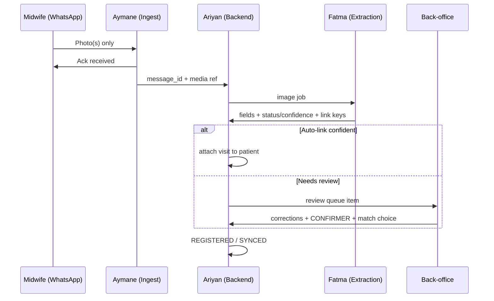

# DayOne — The Offline Midwife

**Team:** Fatma · Aymane · Ariyan  
**Challenge:** Turn paper maternal registry photos into structured, verified, visit-linked digital records.  
**Operating model:** Midwives **only send photos** on WhatsApp; the **platform tracks women** over time; **back-office** handles verification and match decisions (see `docs/operating-model.md`).  
**References:** `consignes-fr-en.pdf` (authoritative rules), `docs/operating-model.md`, `Extra Info CodeML Hackathon.docx`, `manifest.json`, `data/Paper Registry/`, `data/maternal_registry_synthetic.csv` / `.xlsx`

**Out of scope:** Clinical prediction, triage, diagnosis, treatment recommendations.

---

## What judges care about (100 pts)

| Criterion | Points | Primary owner |
|-----------|--------|----------------|
| Extraction quality (field accuracy on test set) | 30 | **Fatma** |
| Uncertainty (status + confidence, agent shows doubt) | 20 | **Fatma** + **Aymane** (back-office UX) |
| Conversational review (Confirm / Edit / Retake, follow-ups, multipage) | 20 | **Aymane** (review UI) + **Ariyan** (queue) |
| Offline robustness (queue, states, sync after reconnect) | 15 | **Ariyan** (+ ingest ack via **Aymane**) |
| Patient linking + privacy (code-based link, no direct IDs stored) | 10 | **Ariyan** |
| Code quality + README | 5 | **All** |

---

## Team ownership

| Person | Role | Main deliverable |
|--------|------|------------------|
| **Fatma** | AI / document extraction | Image → JSON with **status**, **confidence**, and **linking fields** from paper |
| **Aymane** | WhatsApp ingest + back-office review | Thin WhatsApp (photos + ack); review/match UI for staff (web or admin chat) |
| **Ariyan** | Backend / patient registry / sync | Longitudinal profiles, auto-link when confident, review queue, idempotency, encryption |

---

## Core user flow

### Midwife (WhatsApp — capture only)

1. Sends registry photo(s); may send multiple pages in one session.
2. Receives short acknowledgment (*« Reçu. Traitement en cours. »*).
3. No field review, no patient match, no tracking tasks in chat.

### Platform (automatic + back-office)

1. Webhook ingests media; backend stores encrypted blob and enqueues extraction (`PENDING_AI`).
2. **Fatma** returns structured fields with status and confidence (+ **link keys read from paper**).
3. **Ariyan** auto-attaches visit when link keys + confidence are strong; otherwise opens **review queue**.
4. **Back-office** (Aymane UI): **Confirmer / Corriger / Reprendre** (request new photo from facility), follow-ups on `NEEDS_REVIEW`, patient match `[Patiente 1] [Patiente 2] [Nouvelle] [Je ne sais pas]`.
5. After explicit staff **CONFIRMER**, record → `VALIDATED` → `REGISTERED` → `SYNCED`.
6. **Next document** for same woman: same keys on paper → new visit on existing **internal patient profile** (timeline in backend).

### Two-layer architecture (from Extra Info + consignes)

| Layer | Requires internet | Responsibilities |
|-------|-------------------|------------------|
| **Layer 1 — Offline client** | No | Encrypted capture queue on device/gateway, **queue** (`CAPTURED` / `PENDING_AI`); midwife can keep sending photos offline |
| **Layer 2 — Online services** | Yes | Sync queue, **Fatma** extraction, **Ariyan** patient registry & matching, **back-office** review, backup |

Offline capture must **never** be lost when connectivity drops. AI and sync run when the network returns; **human review happens in back-office**, not in the midwife thread.

> **Privacy:** Fiche photos only—no ID cards. Do not store name/phone/address from forms. Link visits using **`registry_file_number`** + **`midwife_patient_code`** read from the fiche.



---

## Agree before coding (all three — Day 0)

- [ ] **One document layout** to support first (e.g. Moroccan *Fiche de surveillance* header + 1–2 follow-on sections from `data/Paper Registry/1-*.jpg` or specimen PNGs).
- [ ] **10–20 fields** for MVP (expand later). Map to CSV columns where useful for evaluation (`data/maternal_registry_synthetic.csv`).
- [ ] **Shared JSON schema** + OpenAPI or short `docs/schema.md` (field names, units, enums).
- [ ] **Field status enum** (from consignes): `KNOWN`, `UNKNOWN`, `NOT_PROVIDED`, `ILLEGIBLE`, `NOT_APPLICABLE`, `NEEDS_REVIEW` — distinct from **human verification** (`human_verified`, verifier, correction history).
- [ ] **Record lifecycle** states: `CAPTURED` → `PENDING_AI` → `AI_PROCESSED` → `NEEDS_REVIEW` → `VALIDATED` → `PATIENT_MATCHED` → `REGISTERED` → `SYNCED` (+ failure: processing, sync, duplicate suspected, manual review).
- [ ] **Patient linking:** internal IDs server-side; link visits using **`registry_file_number` + `midwife_patient_code` read from fiche images** (not name). Match UI for **back-office**: `[Patiente 1] [Patiente 2] [Aucune, créer] [Je ne sais pas]` — never auto-merge on name alone.
- [ ] **Verifier role:** back-office staff (not midwife); document in demo script.
- [ ] **Privacy:** fiche-only input; no collection/storage of names, phone, or address from forms; redact or ignore on extraction; encrypted local queue; no PHI in logs; synthetic data only for third-party models unless approved.
- [ ] **Offline strategy:** consignes require **offline-first** (encrypted local capture + queue). Cloud WhatsApp alone is not full offline — decide: (A) companion local capture app/simulator + sync, or (B) document simulated offline in demo + real WhatsApp when online. Align with organizers if unclear.

### MVP field shortlist (draft — finalize on Day 0)

Administrative (non-PII): `registry_file_number`, `region`, `province`, `facility_name`, `facility_type`, `coverage_mode`, `midwife_patient_code`  
Clinical (examples): `age_years`, `gravidity`, `parity`, `gestational_age_weeks`, `systolic_bp_mmhg`, `diastolic_bp_mmhg`, `hiv_test`, `syphilis_test`, `hepatitis_c_test`, `delivery_mode`, `newborn_sex`, `birth_weight_g`, `visit_date`  
*Do not extract or store patient name fields (often masked on specimens).*

### Registry sections to map (Cuadernito / fiche — extend after MVP)

Use `data/Paper Registry/dossiers_specimen_10_patientes.pdf` and specimen PNGs for full booklet layout. **Fatma** owns the field map in `docs/field-mapping.md`:

1. Patient / administrative (non-PII only per consignes)  
2. Medical & family history  
3. Obstetric history  
4. Current pregnancy (longitudinal antenatal rows)  
5. Delivery  
6. Postpartum & newborn  

Multipage rule: many photos from same sender within a session → **one document** (Aymane groups by time/sender). Re-photo of same booklet → **back-office** sees existing record and chooses what to update (consignes §7).

### Open questions — resolve in Day 0 standup

| # | Question | Default for hackathon build |
|---|----------|-----------------------------|
| A | Primary match key on fiche? | **`midwife_patient_code`** + `registry_file_number`; not name (consignes) |
| B | No code on page? | Provisional patient; **back-office** confirms at match step |
| C | Who sees patient timeline? | Back-office / facility admin; midwife has no tracker UI |
| D | Multipage in one session? | **Yes** — group WhatsApp photos into one `Document` |
| E | Re-digitize same booklet? | **Show existing + selective update** in back-office |
| F | UI language? | French (WhatsApp ack + back-office); preserve `raw_text` |
| G | AI unavailable? | Manual entry in **back-office** (Aymane + Ariyan) |
| H | Follow-up questions? | **Yes** — back-office for `NEEDS_REVIEW` / `ILLEGIBLE` |

Internal display IDs (e.g. `PAT-000001`) are fine if **auto-generated**, never derived from name (Extra Info §8).

### Minimum shared record contract (illustrative)

```json
{
  "internal_patient_id": "uuid-generated",
  "visit_id": "uuid-generated",
  "source_message_id": "whatsapp-message-id",
  "midwife_patient_code": "SF-XXXX",
  "record_status": "NEEDS_REVIEW",
  "lifecycle": "AI_PROCESSED",
  "visit_date": "2026-10-03",
  "fields": {
    "gestational_age_weeks": {
      "raw_text": "38 sem",
      "value": 38,
      "unit": "weeks",
      "confidence": 0.68,
      "field_status": "NEEDS_REVIEW",
      "human_verified": false,
      "validation_flags": [],
      "corrections": []
    }
  },
  "original_image_ref": "encrypted-blob-id",
  "capture_metadata": {
    "captured_at": "ISO-8601",
    "midwife_id": "authenticated-id"
  }
}
```

---

## Milestones (whole team)

| Stage | Goal | Acceptance |
|-------|------|------------|
| **1. Contract & setup** | Same JSON fixture; one WhatsApp message hits webhook | All three run stack locally; `fixtures/sample_extraction.json` committed |
| **2. Core MVP** | Photo → extract → back-office review → **CONFIRMER** → saved visit on patient timeline | End-to-end on 1 specimen image |
| **3. Reliability** | Bad photos, missing fields, corrections, duplicate webhooks | Idempotent saves; no duplicate visits |
| **4. Challenge depth** | Multipage session, patient match, offline queue + sync demo | Meets consignes sections 5–8 |
| **5. Submission** | README, architecture, extraction metrics, demo script | Ready for jury |

---

## Fatma — AI / document extraction

### Goals

- Schema-driven extraction (not generic OCR dump).
- Per-field **status** + **confidence**; null/absent when illegible — **never invent** clinical values.
- Evaluation on held-out images vs CSV/reference where available.

### Task checklist

- [ ] Inspect `data/Paper Registry/` and PDF; document field → schema mapping in `docs/field-mapping.md`.
- [ ] Implement extraction service (HTTP or library callable by Ariyan’s worker): input image → output agreed JSON.
- [ ] Preprocessing only where it helps: crop, deskew, contrast (test on blurred/degraded PNGs).
- [ ] OCR and/or vision model; preserve `raw_text` + normalized `value` + `unit`.
- [ ] **PII policy in pipeline:** strip/ignore name, spouse, ID, phone, address; flag if detected.
- [ ] Plausibility checks (ranges, units); set `NEEDS_REVIEW` / flags instead of silent fixes.
- [ ] Separate **extraction status** from **human_verified** (high confidence ≠ confirmed).
- [ ] **Priority linking fields:** reliable extraction of `registry_file_number` and `midwife_patient_code` from fiche images.
- [ ] Image quality gate: flag unreadable captures → `MANUAL_REVIEW_REQUIRED` / request retake via back-office (not midwife Q&A).
- [ ] Test set: mix of `1-*.jpg`, specimen PNGs, multipage sequences; report accuracy, missing-field recall, false “KNOWN”.
- [ ] Deliver `fixtures/` (success, partial, illegible, PII-heavy redacted) for Aymane/Ariyan offline dev.
- [ ] Wire to Ariyan’s `PENDING_AI` job handler; stable schema version in response.

### Handoff

| Deliverable | Ready when |
|-------------|------------|
| `POST /extract` (or equivalent) | Same sample image → identical schema every run |
| Fixtures + eval notebook/script | Team can cite field-level metrics for README |
| Failure catalog | Documented behaviors for blur, empty checkbox, Arabic snippets |

**Done when:** Uncertain/missing fields always arrive as `NEEDS_REVIEW` / `ILLEGIBLE` / `NOT_PROVIDED`, never as silent `KNOWN`.

---

## Aymane — WhatsApp ingest + back-office review

### Goals

- **WhatsApp:** capture-only channel for midwives (real Cloud API or simulator).
- **Back-office UI:** satisfies consignes human verification—confirm, edit, retake request, manual entry, multipage context, patient match.

### Task checklist — WhatsApp (midwife)

- [ ] Meta Cloud API: test number, webhook HTTPS, signature verification; secrets in env only.
- [ ] Inbound: **images only** (ignore clinical text commands except optional `fin` to close multipage session).
- [ ] Pass `message_id`, sender id, media refs to Ariyan immediately (idempotency).
- [ ] Outbound to midwife: **ack only** (French)—e.g. *« Reçu (page 2/3). Traitement en cours. »*
- [ ] Multipage grouping: same sender + session window → one `document_id` (coordinate with Ariyan).
- [ ] Duplicate webhook → no duplicate jobs.
- [ ] Do **not** ask midwives to confirm fields or choose patients.

### Task checklist — Back-office review

- [ ] UI or CLI admin: list `NEEDS_REVIEW` / `DUPLICATE_SUSPECTED` queue.
- [ ] Show extraction summary with **uncertainty visible** (status + confidence per field).
- [ ] One field at a time or grouped form: **Confirmer / Corriger / Illisible / N/A**.
- [ ] Full recap + **CONFIRMER** before Ariyan commits `VALIDATED`.
- [ ] Patient match screen when Ariyan returns candidates: `[Patiente 1] [Patiente 2] [Nouvelle] [Je ne sais pas]`.
- [ ] Manual entry path when AI failed or offline delay exhausted.
- [ ] Optional: notify facility when review complete (not via midwife chat).

### Example dialogues (French)

**Midwife thread**

| Speaker | Message |
|---------|---------|
| Sage-femme | *[Photo registre]* |
| Bot | Reçu. Traitement en cours. |

**Back-office (demo on laptop)**

| Speaker | Message |
|---------|---------|
| Système | Dossier #142 — 2 champs à revoir. Âge gestationnel : 38 sem (confiance 68 %). |
| Agent | Corriger : 39 sem |
| Système | Correspondance possible : PAT-000014. Confirmer lien ? |
| Agent | CONFIRMER |
| Système | Visite V003 enregistrée sur PAT-000014. |

**Done when:** WhatsApp photo → ack only → back-office correction → committed visit; replayed webhook → one job.

---

## Ariyan — Backend / records / sync / privacy

### Goals

- **Product center:** longitudinal **patient registry** (visits timeline, documents, link keys).
- Offline-first queue, encryption, lifecycle, auto-link + review queue, idempotency.

### Task checklist

- [ ] Data model: `Patient`, `Visit`, `Document` (multipage), `FieldValue`, `ReviewTask`, `Job`, `MediaBlob`, `MidwifeSender` (WhatsApp id only).
- [ ] API for Aymane ingest: `POST /webhooks/whatsapp`, attach media to `Document`.
- [ ] API for back-office: list review queue, get draft, patch fields, confirm visit, list match candidates.
- [ ] API for Fatma: dequeue image jobs, post extraction result, update lifecycle to `AI_PROCESSED`.
- [ ] Persist raw + normalized values, confidence, field_status, validation_flags, correction history, verifier + timestamp.
- [ ] Store original images encrypted at rest; link to record ID, capture time, midwife ID, processing status; role-restricted download.
- [ ] Patient linking: match on `registry_file_number` + `midwife_patient_code` (+ facility id if available); auto-link only above agreed confidence; else queue; never auto-create when plausible match exists.
- [ ] Patient timeline API: list visits/documents for internal patient id (for demo dashboard).
- [ ] Idempotency: WhatsApp `message_id`, job IDs, confirm tokens → no duplicate visits on retry.
- [ ] Transactional confirm: `VALIDATED` + `REGISTERED` then trigger outbound notification job.
- [ ] Offline queue module: `CAPTURED` / `PENDING_AI` while offline; sync worker on reconnect; state machine tests.
- [ ] Local encrypted store spec (mobile/simulator): what gets queued before sync — document for README.
- [ ] Security: HTTPS, auth on admin APIs, no PII in logs, retention policy for temp files, env-based keys.
- [ ] Export: anonymized JSON/CSV for demo dashboard (optional bonus).
- [ ] Re-digitization: same keys photographed again → surface existing document in **review queue** for selective update.

### Offline / recovery matrix

| Situation | Expected behavior |
|-----------|-------------------|
| Phone offline | Messages queue on device (or simulated); nothing lost; sync on reconnect |
| WhatsApp cloud unreachable | Inbound delayed; process when delivered; show “en attente” state |
| Backend restart | Jobs resume; drafts intact |
| Worker crash mid-extract | Retry job; stay `PENDING_AI` or fail visibly |
| Duplicate webhook | Same `message_id` → single visit |

**Done when:** Replay webhook + restart worker + retry confirm → **one** visit, corrections preserved.

---

## Shared integration tasks

- [ ] Monorepo layout agreed (e.g. `services/extraction`, `services/api`, `services/whatsapp-ingest`, `services/backoffice-ui`, `packages/schema`).
- [ ] CI: lint + schema validation on fixtures.
- [ ] README: install, env vars, demo steps, architecture diagram, offline limitations.
- [ ] Demo script (10–15 min) — **narrate roles aloud**:
  1. **Midwife:** send photo on WhatsApp → ack only.
  2. **Back-office:** open queue → fix 2 uncertain fields → CONFIRMER → visit on timeline.
  3. **Midwife:** second photo (same woman) → platform links visit (or back-office confirms match).
  4. **Offline:** queued capture → reconnect → extract → review → sync.
  5. **Recovery:** replay webhook → no duplicate visit.
  6. Show **patient profile** with two visits (tracking requirement).

---

## Evaluation prep (Fatma leads, all contribute)

- [ ] Hold-out image set with manual ground truth (10+ pages).
- [ ] Table: field accuracy, status correctness, confidence calibration notes.
- [ ] README “Known limitations” (Arabic handwriting, checkboxes, etc.).

---

## Repo assets (do not modify originals)

| Asset | Use |
|-------|-----|
| `consignes-fr-en.pdf` | Full rules, statuses, lifecycle, grading (**source of truth**) |
| `Extra Info CodeML Hackathon.docx` | Two-layer offline/online design, V1 scope, workflow Q&A |
| `data/Paper Registry/*` | Specimen images + `dossiers_specimen_10_patientes.pdf` (10 patients); `1-1.jpg`…`1-5.jpg` sample fiche |
| `data/maternal_registry_synthetic.csv` | Ground-truth-style table, **200 rows** (+ header) |
| `data/maternal_registry_synthetic.xlsx` | Same dataset as CSV (prefer one in scripts; keep both read-only) |
| `manifest.json` | **132** listed files with SHA-256 — do not modify listed assets |
| `docs/operating-model.md` | Fiche-only capture, linking keys, back-office verification |
| `tasks.md` | Team backlog (Fatma / Aymane / Ariyan) |

---

## Quick links

- [WhatsApp Cloud API docs](https://developers.facebook.com/docs/whatsapp/cloud-api)
- [Meta WhatsApp API examples](https://github.com/fbsamples/whatsapp-api-examples)
- Dataset folder (organizers): [Google Drive](https://drive.google.com/drive/folders/1RtBBVDkPFfMiouPEry2Ogzu26Odh8JUF?usp=sharing)

---

*Last updated: capture-only midwife + platform patient tracking + back-office verification; privacy from `consignes-fr-en.pdf`.*
