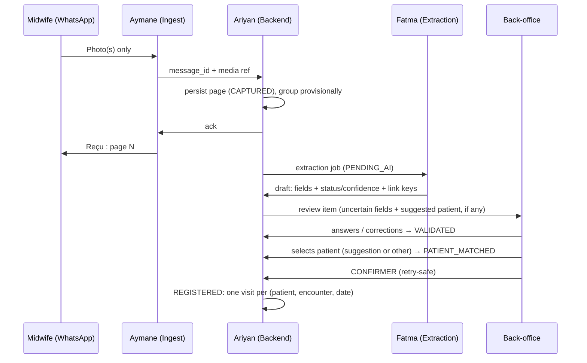

# DayOne — The Offline Midwife

**Team:** Fatma · Aymane · Ariyan  
**Challenge:** Turn paper maternal registry photos into structured, verified, visit-linked digital records.  
**Operating model:** Midwives **only send photos** on WhatsApp; the **platform tracks women** over time; **back-office** handles verification and match decisions (see `docs/operating-model.md`).  
**References:** `consignes-fr-en.pdf` (authoritative rules), `docs/operating-model.md`, `Extra Info CodeML Hackathon.docx`, `manifest.json`, `data/Paper Registry/`, `data/maternal_registry_synthetic.csv` / `.xlsx`

**Out of scope:** Clinical prediction, triage, diagnosis, treatment recommendations.

---

## Current MVP (fixture-driven, runs today)

`python -m dayone` → <http://127.0.0.1:8000>. Demo: Photo → acknowledgment → draft → back-office correction → patient selection → confirmation → patient timeline. Contracts: `docs/schema.md`, `docs/identity-strategy.md`, `fixtures/*.json`.

| Owner | MVP scope | Acceptance | State |
|-------|-----------|------------|-------|
| **Fatma** | One layout (`ma-fiche-surveillance-grossesse-v1`), 12 fields, success + uncertain fixtures | Both fixtures validate against the shared schema (`tests/test_schema.py`) | Done (fixtures hand-written; real extractor next) |
| **Ariyan** | Store documents/drafts; review, correction, confirmation, timeline operations | Confirmation saves exactly one visit, including on retries | Done (`dayone/service.py`, `store.py`) |
| **Aymane** | Simulated photo ingest + back-office review screen | Reviewer corrects a field, chooses a patient, confirms, sees the saved visit | Done (`dayone/static/`) |

### Decisions that resolve the review comments

1. **Verification gate:** auto-link only *suggests* a candidate. `PATIENT_MATCHED` needs a reviewer click, `REGISTERED` needs **CONFIRMER**. `NEW` is never automatic.
2. **Document ≠ visit:** keys identify the woman; a visit is one grid column identified by (`patient_id`, `encounter_type`, `visit_date`). Re-photographed columns give `EXISTS_SAME` (no new visit) or `EXISTS_DIFFERENT` (reviewer chooses update/keep).
3. **Multipage grouping is provisional:** sender + 8 s window; back-office can split or regroup pages (drafts re-extracted). Becomes `CONFIRMED` at registration.
4. **Offline scope:** no companion app. Phone-side buffering is WhatsApp's own outbox (not ours). Our durable queue is the platform database; the demo proves AI-outage queueing, restart durability and idempotent retries. See `docs/operating-model.md` § Offline for the gaps.
5. **Conversational requirement:** the instructions put verification with the midwife. Back-office review is a **deviation**, not compliance: get organizer confirmation in writing and state it in the README/demo. See `docs/operating-model.md`.

---

## What judges care about (100 pts)

| Criterion | Points | Primary owner |
|-----------|--------|----------------|
| Extraction quality (field accuracy on test set) | 30 | **Fatma** |
| Uncertainty (status + confidence, agent shows doubt) | 20 | **Fatma** + **Aymane** (back-office UX) |
| Conversational review (Confirm / Edit / Retake, follow-ups, multipage) — **at risk**: reviewer is staff, not midwife; Retake missing | 20 | **Aymane** (review UI) + **Ariyan** (queue) |
| Offline robustness (queue, states, sync after reconnect) | 15 | **Ariyan** (+ ingest ack via **Aymane**) |
| Patient linking + privacy (code-based link, no direct IDs stored) | 10 | **Ariyan** |
| Code quality + README | 5 | **All** |

---

## Team ownership

| Person | Role | Main deliverable |
|--------|------|------------------|
| **Fatma** | AI / document extraction | Image → JSON with **status**, **confidence**, and **linking fields** from paper |
| **Aymane** | WhatsApp ingest + back-office review | Thin WhatsApp (photos + ack); review/match UI for staff (web or admin chat) |
| **Ariyan** | Backend / patient registry / sync | Longitudinal profiles, patient suggestions, review queue, idempotency, encryption |

---

## Core user flow

### Midwife (WhatsApp — capture only)

1. Sends registry photo(s); may send multiple pages in one session.
2. Receives one acknowledgment per page (*« Reçu : page N. Merci, le traitement est en cours. »*).
3. No field review, no patient match, no tracking tasks in chat.

### Platform (automatic + back-office)

1. Webhook ingests media; the page is persisted (`CAPTURED`) **before** the acknowledgment; duplicate `message_id` is ignored.
2. Pages are grouped provisionally (sender + window); then the document is queued for extraction (`PENDING_AI`).
3. **Fatma** returns structured fields with status and confidence (+ **link keys read from paper**).
4. **Back-office** (Aymane UI) answers each uncertain field: **Confirmer / Corriger / Illisible / Non renseigné** → `VALIDATED`.
5. **Ariyan** lists candidates and **suggests** one when keys match strongly; the reviewer **selects** `[Patiente N] [Nouvelle] [Je ne sais pas]` → `PATIENT_MATCHED`.
6. Summary shows each visit as new / already registered / differing; reviewer presses **CONFIRMER** → `REGISTERED` (one visit per encounter, idempotent). `SYNCED` is out of MVP scope.
7. **Next document** for same woman: same keys → suggested patient; already-registered dates are not duplicated.

### Two-layer architecture (from Extra Info + consignes), as decided

| Layer | Requires internet | Where in our design |
|-------|-------------------|---------------------|
| **Layer 1 — Capture** | No (phone side) | WhatsApp's own outbox on the phone (not ours); then our durable intake queue (`CAPTURED` / `PENDING_AI` in the platform DB) |
| **Layer 2 — Online services** | Yes | **Fatma** extraction, **Ariyan** registry & matching, **back-office** review |

No companion app. Gaps (device-side encrypted storage, encryption at rest, `SYNCED`) are listed in `docs/operating-model.md` § Offline.

> **Privacy:** Fiche photos only—no ID cards. Do not store name/phone/address from forms. Link visits using **`registry_file_number`** + **`midwife_patient_code`** read from the fiche.

Every path goes through the reviewer; there is no branch where a confident auto-link registers on its own.

---

## Agree before coding (all three — Day 0)

- [x] **One document layout:** `ma-fiche-surveillance-grossesse-v1` (cover `1-1.jpg` + visit grids `1-4.jpg` / `1-5.jpg`).
- [x] **12 fields** for MVP (4 document + 8 per encounter), see `docs/schema.md`.
- [x] **Shared JSON schema:** `docs/schema.md` + `dayone/schema.py` validator.
- [x] **Field status enum** (from consignes): `KNOWN`, `UNKNOWN`, `NOT_PROVIDED`, `ILLEGIBLE`, `NOT_APPLICABLE`, `NEEDS_REVIEW` — separate from **verification** (`UNVERIFIED` / `CONFIRMED` / `CORRECTED`, append-only `corrections[]`).
- [x] **Record lifecycle:** `CAPTURED` → `PENDING_AI` → `AI_PROCESSED` → `NEEDS_REVIEW` → `VALIDATED` → `PATIENT_MATCHED` → `REGISTERED` (+ `PROCESSING_FAILED`, `DUPLICATE_SUSPECTED`; `SYNCED` reserved).
- [x] **Patient linking:** facility-scoped `registry_file_number` + `midwife_patient_code`; auto-link only suggests; `[Patiente N] [Nouvelle patiente] [Je ne sais pas]`. See `docs/identity-strategy.md`.
- [x] **Verifier role:** back-office staff (not midwife), a **declared deviation** from the instructions (see `docs/operating-model.md`).
- [ ] **Organizer confirmation in writing:** back-office verification instead of midwife; WhatsApp outbox as the phone-side queue.
- [ ] **Privacy:** fiche-only input; no names/phone/address stored; redact on extraction; no PHI in logs (done); encryption at rest (todo); synthetic data only for third-party models unless approved.
- [x] **Offline strategy:** no companion app. Durable queue = platform DB; phone-side buffering = WhatsApp outbox. Demo proves AI outage + restart + idempotent retries; device-side encrypted storage is a documented gap.

### MVP field shortlist (draft — finalize on Day 0)

Administrative (non-PII): `registry_file_number`, `region`, `province`, `facility_name`, `facility_type`, `coverage_mode`, `midwife_patient_code`  
Clinical (examples): `age_years`, `gravidity`, `parity`, `gestational_age_weeks`, `systolic_bp_mmhg`, `diastolic_bp_mmhg`, `hiv_test`, `syphilis_test`, `hepatitis_c_test`, `delivery_mode`, `newborn_sex`, `birth_weight_g`, `visit_date`  
*Do not extract or store patient name fields (often masked on specimens).*

### Registry sections to map (Cuadernito / fiche — extend after MVP)

Use `data/Paper Registry/dossiers_specimen_10_patientes.pdf` and specimen PNGs for full booklet layout. **Fatma** owns the field map in `docs/field-mapping.md`:

1. Patient / administrative (non-PII only per consignes)  
2. Medical & family history  
3. Obstetric history  
4. Current pregnancy (longitudinal antenatal rows)  
5. Delivery  
6. Postpartum & newborn  

Multipage rule: photos from the same sender within the grouping window → **one provisional document**; back-office can split or regroup. Re-photo of same booklet → visits matched by date: identical columns are not duplicated, differing ones need an update/keep decision (consignes §7).

### Open questions — resolve in Day 0 standup

| # | Question | Default for hackathon build |
|---|----------|-----------------------------|
| A | Primary match key on fiche? | **`midwife_patient_code`** + `registry_file_number`; not name (consignes) |
| B | No code on page? | No suggestion; reviewer picks a patient or creates one (flag `NO_LINK_KEY`) |
| C | Who sees patient timeline? | Back-office / facility admin; midwife has no tracker UI |
| D | Multipage in one session? | **Yes** — provisional `Document`, split/regroup in back-office |
| E | Re-digitize same booklet? | Visit identity by date: `EXISTS_SAME` skipped, `EXISTS_DIFFERENT` → update/keep |
| F | UI language? | French (WhatsApp ack + back-office); preserve `raw_text` |
| G | AI unavailable? | Manual entry in **back-office** (Aymane + Ariyan) |
| H | Follow-up questions? | **Yes** — back-office for `NEEDS_REVIEW` / `ILLEGIBLE` |

Internal display IDs (e.g. `PAT-000001`) are fine if **auto-generated**, never derived from name (Extra Info §8).

### Shared record contract

Agreed and implemented: `docs/schema.md` (fields, statuses, IDs, extraction version, correction history). Reference draft: `fixtures/sample_extraction.json`.

---

## Milestones (whole team)

| Stage | Goal | Acceptance |
|-------|------|------------|
| **1. Contract & setup** ✅ | Same JSON fixture; one simulated WhatsApp message hits the webhook | `docs/schema.md`, `docs/identity-strategy.md`, `fixtures/sample_extraction.json` committed |
| **2. Core MVP** ✅ (fixtures) | Photo → draft → back-office review → **CONFIRMER** → saved visit on patient timeline | End-to-end in the browser; 24 tests pass |
| **3. Reliability** (partly) | Bad photos, missing fields, corrections, duplicate webhooks | Idempotent saves done; real bad-photo handling needs the real extractor |
| **4. Challenge depth** | Real extractor, Retake request, real WhatsApp sandbox, encryption at rest | Meets consignes sections 5–8 (minus declared deviations) |
| **5. Submission** | README, architecture, extraction metrics, demo script | Ready for jury |

---

## Fatma — AI / document extraction

### Goals

- Schema-driven extraction (not generic OCR dump).
- Per-field **status** + **confidence**; null/absent when illegible — **never invent** clinical values.
- Evaluation on held-out images vs CSV/reference where available.

### Task checklist

- [x] MVP: layout + 12-field map (`docs/schema.md`), `fixtures/success_extraction.json` and `fixtures/sample_extraction.json` (2 uncertain fields).
- [ ] Replace `FixtureExtractor` (`dayone/extraction.py`) with a real extractor that has the same `extract(page_refs)` → draft contract and `extractor_version`.
- [ ] Inspect `data/Paper Registry/` and PDF; extend the field map in `docs/field-mapping.md` beyond the MVP layout.
- [ ] Preprocessing only where it helps: crop, deskew, contrast (test on blurred/degraded PNGs).
- [ ] OCR and/or vision model; preserve `raw_text` + normalized `value` + `unit`.
- [ ] **PII policy in pipeline:** strip/ignore name, spouse, ID, phone, address; flag if detected.
- [ ] Plausibility checks (ranges, units); set `NEEDS_REVIEW` / flags instead of silent fixes.
- [ ] Separate **extraction status** from **human_verified** (high confidence ≠ confirmed).
- [ ] **Priority linking fields:** reliable extraction of `registry_file_number` and `midwife_patient_code` from fiche images.
- [ ] Image quality gate: flag unreadable captures → `MANUAL_REVIEW_REQUIRED` / request retake via back-office (not midwife Q&A).
- [ ] Test set: mix of `1-*.jpg`, specimen PNGs, multipage sequences; report accuracy, missing-field recall, false “KNOWN”.
- [ ] Deliver `fixtures/` (success, partial, illegible, PII-heavy redacted) for Aymane/Ariyan offline dev.
- [ ] Wire to Ariyan’s `PENDING_AI` job handler; stable schema version in response.

### Handoff

| Deliverable | Ready when |
|-------------|------------|
| `POST /extract` (or equivalent) | Same sample image → identical schema every run |
| Fixtures + eval notebook/script | Team can cite field-level metrics for README |
| Failure catalog | Documented behaviors for blur, empty checkbox, Arabic snippets |

**Done when:** Uncertain/missing fields always arrive as `NEEDS_REVIEW` / `ILLEGIBLE` / `NOT_PROVIDED`, never as silent `KNOWN`.

---

## Aymane — WhatsApp ingest + back-office review

### Goals

- **WhatsApp:** capture-only channel for midwives (real Cloud API or simulator).
- **Back-office UI:** carries the rubric's conversational review mechanics (confirm, edit, retake request, manual entry, multipage, patient match) with staff as the actor—a declared deviation from "verified by the midwife".

### MVP (done)

- [x] Simulated phone: pick fiche photos, send, see one acknowledgment per page, replay the last webhook.
- [x] Back-office screen: queue, one question at a time, correction with server-side validation, patient selection with suggestion highlighted, summary with update/keep decisions, **CONFIRMER**, timeline.
- [x] Split/regroup pages; AI on/off toggle; manual entry when extraction fails.

### Task checklist — WhatsApp (midwife)

- [ ] **Retake request:** reviewer button that sends the midwife *« Merci de reprendre la photo de la page N »* (only rubric item still missing).
- [ ] Meta Cloud API: test number, webhook HTTPS, signature verification; secrets in env only.
- [ ] Inbound: **images only** (ignore clinical text commands except optional `fin` to close multipage session).
- [ ] Pass `message_id`, sender id, media refs to Ariyan immediately (idempotency).
- [ ] Outbound to midwife: **ack only** (French)—e.g. *« Reçu (page 2/3). Traitement en cours. »*
- [ ] Multipage grouping: same sender + session window → one `document_id` (coordinate with Ariyan).
- [ ] Duplicate webhook → no duplicate jobs.
- [ ] Do **not** ask midwives to confirm fields or choose patients.

### Task checklist — Back-office review

- [ ] UI or CLI admin: list `NEEDS_REVIEW` / `DUPLICATE_SUSPECTED` queue.
- [ ] Show extraction summary with **uncertainty visible** (status + confidence per field).
- [ ] One field at a time or grouped form: **Confirmer / Corriger / Illisible / N/A**.
- [ ] Full recap + **CONFIRMER** before Ariyan commits `VALIDATED`.
- [ ] Patient match screen when Ariyan returns candidates: `[Patiente 1] [Patiente 2] [Nouvelle] [Je ne sais pas]`.
- [ ] Manual entry path when AI failed or offline delay exhausted.
- [ ] Optional: notify facility when review complete (not via midwife chat).

### Example dialogues (French)

**Midwife thread**

| Speaker | Message |
|---------|---------|
| Sage-femme | *[Photo registre]* |
| Bot | Reçu. Traitement en cours. |

**Back-office (demo on laptop)**

| Speaker | Message |
|---------|---------|
| Système | Dossier #142 — 2 champs à revoir. Âge gestationnel : 38 sem (confiance 68 %). |
| Agent | Corriger : 39 sem |
| Système | Correspondance possible : PAT-000014. Confirmer lien ? |
| Agent | CONFIRMER |
| Système | Visite V003 enregistrée sur PAT-000014. |

**Done when:** WhatsApp photo → ack only → back-office correction → committed visit; replayed webhook → one job.

---

## Ariyan — Backend / records / sync / privacy

### Part 3 implementation (ariyan-backend)

Atlas encrypted persistence and original-photo storage, encrypted bridge outbox,
extraction leases/callbacks, grouped upload APIs, selected-field update controls,
visit version conflicts and timeline history are implemented. See
`docs/backend-part3.md` for contracts and Windows setup in `README.md`.
Live Atlas verification requires an Atlas URI; real Meta transport and OCR remain
teammate integrations. Shared-token authentication is implemented; per-user/facility
RBAC, automated retention and downstream export remain gaps. The fixture demo
remains SQLite and unencrypted.

### Goals

- **Product center:** longitudinal **patient registry** (visits timeline, documents, link keys).
- Offline-first queue, encryption, lifecycle, auto-link + review queue, idempotency.

### MVP (done)

- [x] SQLite store: facilities, senders, documents (revision, provisional grouping), pages (unique `source_message_id`), patients (facility-unique keys), visits (unique patient + encounter + date), messages, events.
- [x] Operations: ingest, close capture, extraction worker, review field, select patient, confirm (idempotent), move page, manual entry, timeline.
- [x] Optimistic concurrency (`expected_revision`); stale extraction results discarded.

### Task checklist

- [ ] Encryption at rest for the database and stored images; auth on admin APIs.
- [ ] Data model: `Patient`, `Visit`, `Document` (multipage), `FieldValue`, `ReviewTask`, `Job`, `MediaBlob`, `MidwifeSender` (WhatsApp id only).
- [x] API for Aymane ingest: `POST /webhooks/whatsapp`, attach media to `Document`.
- [x] API for back-office: list review queue, get draft, patch fields, confirm visit, list match candidates.
- [x] API for Fatma: dequeue image jobs, post extraction result, update lifecycle to `AI_PROCESSED`.
- [x] Persist raw + normalized values, confidence, field_status, validation_flags, correction history, verifier + timestamp.
- [x] Store original images encrypted at rest; link to record ID, capture time, midwife ID, processing status; role-restricted download.
- [x] Patient linking: facility-scoped `registry_file_number` + `midwife_patient_code`; strong match only **suggests**; reviewer selects; never auto-create.
- [x] Patient timeline API: list visits/documents for internal patient id (for demo dashboard).
- [x] Idempotency: WhatsApp `message_id`, job IDs, confirm tokens → no duplicate visits on retry.
- [ ] Transactional confirm: `VALIDATED` + `REGISTERED` then trigger outbound notification job.
- [ ] Offline queue module: `CAPTURED` / `PENDING_AI` while offline; sync worker on reconnect; state machine tests.
- [ ] Local encrypted store spec (mobile/simulator): what gets queued before sync — document for README.
- [ ] Security: HTTPS, auth on admin APIs, no PII in logs, retention policy for temp files, env-based keys.
- [ ] Export: anonymized JSON/CSV for demo dashboard (optional bonus).
- [x] Re-digitization: same keys photographed again → surface existing document in **review queue** for selective update.

### Offline / recovery matrix

| Situation | Expected behavior |
|-----------|-------------------|
| Phone offline | WhatsApp's outbox holds the photos (not our code); delivered on reconnect; replays deduplicated |
| WhatsApp cloud unreachable | Inbound delayed; process when delivered |
| AI unavailable | Documents stay `PENDING_AI` (“IA indisponible” shown); processed when it returns |
| Backend restart | Jobs resume; drafts intact |
| Worker crash mid-extract | Retry job; stay `PENDING_AI` or fail visibly |
| Duplicate webhook | Same `message_id` → single visit |

**Done when:** Replay webhook + restart worker + retry confirm → **one** visit, corrections preserved.

---

## Shared integration tasks

- [ ] Monorepo layout agreed (e.g. `services/extraction`, `services/api`, `services/whatsapp-ingest`, `services/backoffice-ui`, `packages/schema`).
- [ ] CI: lint + schema validation on fixtures.
- [ ] README: install, env vars, demo steps, architecture diagram, offline limitations.
- [x] Demo script (in `README.md`) — **narrate roles aloud** and state the back-office deviation:
  1. **Midwife:** send `1-1.jpg` + `1-5.jpg` → one ack per page.
  2. **Back-office:** fix the 2 uncertain fields → select the suggested patient → CONFIRMER → 3 new visits on the timeline (6 total).
  3. **Outage:** untick "IA disponible", send photos → queued; tick again → processed.
  4. **Recovery:** replay webhook → no duplicate; confirm again → same result, no new visit.
  5. **Grouping:** split a page into a new document.

---

## Evaluation prep (Fatma leads, all contribute)

- [ ] Hold-out image set with manual ground truth (10+ pages).
- [ ] Table: field accuracy, status correctness, confidence calibration notes.
- [ ] README “Known limitations” (Arabic handwriting, checkboxes, etc.).

---

## Repo assets (do not modify originals)

| Asset | Use |
|-------|-----|
| `consignes-fr-en.pdf` | Full rules, statuses, lifecycle, grading (**source of truth**) |
| `Extra Info CodeML Hackathon.docx` | Two-layer offline/online design, V1 scope, workflow Q&A |
| `data/Paper Registry/*` | Specimen images + `dossiers_specimen_10_patientes.pdf` (10 patients); `1-1.jpg`…`1-5.jpg` sample fiche |
| `data/maternal_registry_synthetic.csv` | Ground-truth-style table, **200 rows** (+ header) |
| `data/maternal_registry_synthetic.xlsx` | Same dataset as CSV (prefer one in scripts; keep both read-only) |
| `manifest.json` | **132** listed files with SHA-256 — do not modify listed assets |
| `docs/operating-model.md` | Fiche-only capture, linking keys, back-office verification |
| `tasks.md` | Team backlog (Fatma / Aymane / Ariyan) |

---

## Quick links

- [WhatsApp Cloud API docs](https://developers.facebook.com/docs/whatsapp/cloud-api)
- [Meta WhatsApp API examples](https://github.com/fbsamples/whatsapp-api-examples)
- Dataset folder (organizers): [Google Drive](https://drive.google.com/drive/folders/1RtBBVDkPFfMiouPEry2Ogzu26Odh8JUF?usp=sharing)

---

*Last updated: fixture-driven MVP; suggestion-only linking, date-based visit identity, provisional grouping, offline scope and conversational deviation documented.*
