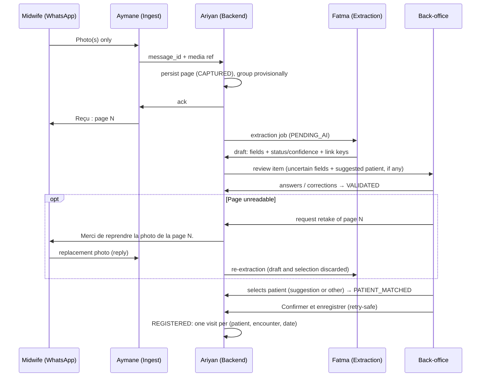

# DayOne — The Offline Midwife

**Team:** Fatma · Aymane · Ariyan  
**Challenge:** Turn paper maternal registry photos into structured, verified, visit-linked digital records.  
**Operating model:** Midwives **only send photos** on WhatsApp; the **platform tracks women** over time; **back-office** handles verification and match decisions (see `docs/operating-model.md`).  
**References:** `consignes-fr-en.pdf` (authoritative rules), `docs/operating-model.md`, `docs/schema.md`, `docs/identity-strategy.md`, `docs/excel-field-mapping.md`, `Extra Info CodeML Hackathon.docx`, `manifest.json`, `data/Paper Registry/`, `data/maternal_registry_synthetic.csv` / `.xlsx`

**Out of scope:** Clinical prediction, triage, diagnosis, treatment recommendations.

**Checkbox rule:** `[x]` only when the item is in the code, with the evidence (file or test) next to it. Anything partial stays `[ ]`, with a note saying what exists.

---

## Current MVP (fixture-driven, runs today)

`python -m dayone` starts the app at <http://127.0.0.1:8000>. Demo flow: photo, acknowledgment, draft, back-office correction, patient selection, confirmation, patient timeline, plus a page retake (request, replacement photo, re-extraction). Tests: `python -m unittest discover -s tests -v` (62 tests).

By default the WhatsApp side is a **simulator**: a phone panel in the browser posts JSON to `/api/whatsapp/messages`. A Cloud API adapter (`--whatsapp-mode cloud`, `docs/whatsapp-cloud.md`) is implemented and tested against a mocked Meta API only; it has **not** been run against Meta's sandbox. The extractor is a **fixture lookup**, not a model.

| Owner | MVP scope | Acceptance | State |
|-------|-----------|------------|-------|
| **Fatma** | One layout (`ma-fiche-surveillance-grossesse-v1`), 12 fields, success + uncertain fixtures | Both fixtures validate against the shared schema | Done: `tests/test_schema.py`. Fixture values are illustrative, not ground truth |
| **Ariyan** | Store documents/drafts; review, correction, confirmation, timeline operations | Confirmation saves exactly one visit, including on retries | Done: `dayone/service.py`, `test_confirm_retry_saves_visits_once` |
| **Aymane** | Simulated photo ingest + back-office review screen + retake | Reviewer corrects a field, chooses a patient, confirms, sees the saved visit; can ask for a page again | Done: `dayone/static/`, `tests/test_retake.py`, checked end to end in the browser |

### Decisions that resolve the review comments

1. **Verification gate:** auto-link only *suggests* a candidate. `PATIENT_MATCHED` needs a reviewer click, and `REGISTERED` needs **Confirmer et enregistrer**. `NEW` is never automatic (`test_photo_to_timeline` asserts that no selection exists before the click).
2. **Document ≠ visit:** keys identify the woman; a visit is one grid column identified by (`patient_id`, `encounter_type`, `visit_date`). A re-photographed column gives `EXISTS_SAME` (no new visit) or `EXISTS_DIFFERENT` (reviewer chooses update or keep).
3. **Multipage grouping is provisional:** grouped by sender plus an 8 s window. Back-office can split or regroup pages, and the affected drafts are re-extracted. Grouping becomes `CONFIRMED` at registration.
4. **Offline scope:** no companion app. Phone-side buffering is WhatsApp's own outbox, which is not our code. Our durable queue is the platform database. See `docs/operating-model.md` § Offline.
5. **Conversational requirement:** the instructions put verification with the midwife. Back-office review is a **declared deviation**, not compliance. See `docs/operating-model.md`.

---

## Blockers and open gaps (keep visible until resolved)

| # | Gap | Why it matters | Owner | State |
|---|-----|----------------|-------|-------|
| 1 | **Organizer confirmation in writing:** back-office verification instead of the midwife | Instructions say "verified by the midwife"; 20-pt rubric item at risk | All | Not obtained (verbal only) |
| 2 | **Organizer confirmation in writing:** WhatsApp's outbox counts as the phone-side offline queue | Instructions require encrypted local storage and an offline-capture demo | All | Not obtained |
| 3 | **Encryption at rest**: SQLite database (drafts, visits, keys) and any stored media | "Local storage on the device must be encrypted" (consignes §4) | Ariyan | Not implemented: database is plain SQLite in `var/` |
| 4 | **Authentication and roles** on every `/api/*` route | Anyone who can reach the port can review, confirm, read timelines, or call `POST /api/demo/reset` (wipes the database). Reviewer identity is a free-text `X-Reviewer` header | Ariyan + Aymane | Not implemented; server binds to `127.0.0.1` by default |
| 5 | **Offline-capture demo** ("an offline capture, the return of connectivity") | Required demo scenario | Ariyan + Aymane | Not demonstrated. We only show the platform-side equivalent (AI outage, then recovery) |
| 6 | **`SYNCED`** / central sync | Lifecycle state in the instructions | Ariyan | Reserved, not implemented |
| 7 | **Retake photo** over real WhatsApp | Rubric item (Confirm / Edit / **Retake**) | Aymane | Simulator done (`tests/test_retake.py`). Cloud API: the request is sent as a reply quoting the photo, and a reply quoting the request replaces the page. This is tested with mocks only (`test_reply_quoting_the_retake_request_replaces_the_page`). Open: sandbox check that image replies carry `context.id` (not documented for images), and template messages for requests sent more than 24 h after the midwife's last message. The actor is still back-office staff (#1) |
| 8 | **Real extractor** | 30-pt extraction criterion | Aymane (from Fatma's extractor) | Partial: `--extractor paddle` runs local PaddleOCR (project `.venv`, `docs/ocr.md`) and reads the specimen visit grid, one encounter per visit column. Evaluated against a checked ground truth of the 80 specimen pages (`docs/ocr-evaluation.md`): clean renders 0 wrong KNOWN of 667 written values (72 % / 67 % correct KNOWN, development / held-out); simulated photos 8 wrong KNOWN of 979; every visit column found. Open: real phone photos (none tested), wrong KNOWN values on photos are saved as confirmed unless the reviewer catches them in the summary, the pink booklet layout, layout ID (D7), human spot-check of the ground truth, Tesseract unmeasured. Fixture mode stays the default |
| 9 | **Real WhatsApp integration** | Bonus item; needed for a real pilot | Aymane | Partial: adapter implemented and tested against a mocked Meta API (`tests/test_whatsapp_cloud.py`). Observed on 2026-10-03 with a real Meta app (unpublished): webhook verification, a signed dashboard test webhook, real media upload and download into the review workflow, and duplicate replay. Open: real inbound messages need a **published app, which requires business verification**, and our app must be **subscribed to the WABA** (`GET /{waba-id}/subscribed_apps` does not list it; the fix, a `POST`, was not made). Also open: real sends, which are not authorised (sandbox databases are held), retake reply context, and template messages (`docs/whatsapp-cloud.md`, *Observed against Meta*). Depends on #3 (photos stored unencrypted), #4 and #10 (only the webhook listener may be exposed, through an HTTPS tunnel) |
| 10 | **HTTPS** | Transport security | Ariyan | Not implemented (plain HTTP on localhost) |

---

## What judges care about (100 pts)

| Criterion | Points | Primary owner | Current state |
|-----------|--------|---------------|---------------|
| Extraction quality (field accuracy on test set) | 30 | **Fatma** | Local OCR (optional) measured on the synthetic specimen with a development / held-out split (`docs/ocr-evaluation.md`); no real photo tested; ground truth awaiting a human spot-check |
| Uncertainty (status + confidence, agent shows doubt) | 20 | **Fatma** + **Aymane** | Contract, validator and UI done. With local OCR, uncertain values go to review (0 wrong KNOWN on clean renders, 8 of 979 on simulated photos); scores are shown as indicative and are not calibrated |
| Conversational review (Confirm / Edit / Retake, follow-ups, multipage) | 20 | **Aymane** + **Ariyan** | **At risk**: reviewer is staff, not the midwife. Retake works in the simulator only |
| Offline robustness (queue, states, sync after reconnect) | 15 | **Ariyan** (+ **Aymane**) | Platform queue durable; device-side offline and sync not done |
| Patient linking + privacy (code-based link, no direct IDs stored) | 10 | **Ariyan** | Linking done; encryption and auth missing |
| Code quality + README | 5 | **All** | README + tests done; no CI |

---

## Team ownership

| Person | Role | Main deliverable |
|--------|------|------------------|
| **Fatma** | AI / document extraction | Image → draft JSON with **status**, **confidence**, and **link keys** from paper |
| **Aymane** | WhatsApp ingest + back-office review | WhatsApp channel (photos + ack; simulator today); review/match UI for staff |
| **Ariyan** | Backend / patient registry / sync | Longitudinal profiles, patient suggestions, review queue, idempotency, encryption |

---

## Core user flow

### Midwife (WhatsApp — capture only; simulated in the MVP)

1. Sends registry photo(s); may send multiple pages in one session.
2. Receives one acknowledgment per page: *« Reçu : page N. Merci, le traitement est en cours. »* In the MVP the acknowledgment is stored and shown in the simulated thread; nothing is sent to a real phone.
3. Only when the back-office asks: receives *« Merci de reprendre la photo de la page N. »* and replies with a new photo (simulator only).
4. No field review, no patient match, no tracking tasks in chat.

### Platform (automatic + back-office)

1. Ingest persists the page (`CAPTURED`) **before** returning the acknowledgment; a duplicate `message_id` is ignored.
2. Pages are grouped provisionally (sender + window); then the document is queued for extraction (`PENDING_AI`).
3. **Fatma**'s extractor returns a draft with status and confidence per field, plus the link keys read from paper.
4. **Back-office** (Aymane's UI) answers each uncertain field with **Confirmer / Corriger / Illisible / Non renseigné**, which leads to `VALIDATED`. If a page is unreadable, the reviewer can **request a retake**: confirmation is blocked until the new photo arrives, then the draft is discarded and re-extracted (original page kept).
5. **Ariyan**'s backend lists candidates and **suggests** one when keys match strongly. The reviewer **selects** `[Patiente N] [Nouvelle patiente] [Je ne sais pas]`, which leads to `PATIENT_MATCHED`.
6. The summary shows each visit as new, already registered, or differing. The reviewer presses **Confirmer et enregistrer**, which leads to `REGISTERED` (one visit per encounter, idempotent). `SYNCED` is not implemented.
7. **Next document** for the same woman: same keys give the same suggested patient, and already-registered dates are not duplicated.

### Two-layer architecture (from Extra Info + consignes), as decided

| Layer | Requires internet | Where in our design |
|-------|-------------------|---------------------|
| **Layer 1 — Capture** | No (phone side) | WhatsApp's own outbox on the phone (not ours, not demonstrated); then our durable intake queue (`CAPTURED` / `PENDING_AI` in the platform database) |
| **Layer 2 — Online services** | Yes | **Fatma** extraction, **Ariyan** registry & matching, **back-office** review |

> **Privacy:** Fiche photos only—no ID cards. Do not store name/phone/address from forms. Link visits using **`registry_file_number`** + **`midwife_patient_code`** read from the fiche.

Every path goes through the reviewer; there is no branch where a confident auto-link registers on its own.

---

## Day 0 agreements

- [x] **One document layout:** `ma-fiche-surveillance-grossesse-v1` (cover `1-1.jpg` + visit grids `1-4.jpg` / `1-5.jpg`), in `docs/schema.md` and `dayone/schema.py` (`LAYOUT_ID`).
- [x] **12-field contract** (below), in `dayone/schema.py` (`test_field_catalog_has_twelve_fields`).
- [x] **Shared JSON schema:** `docs/schema.md` + `validate_draft` (`test_fixtures_follow_schema`).
- [x] **Field status enum** (from consignes): `KNOWN`, `UNKNOWN`, `NOT_PROVIDED`, `ILLEGIBLE`, `NOT_APPLICABLE`, `NEEDS_REVIEW`. Kept separate from **verification** (`UNVERIFIED` / `CONFIRMED` / `CORRECTED`) with an append-only `corrections[]` (`test_photo_to_timeline` checks the correction history).
- [x] **Record lifecycle:** `CAPTURED` → `PENDING_AI` → `AI_PROCESSED` → `NEEDS_REVIEW` → `VALIDATED` → `PATIENT_MATCHED` → `REGISTERED`, plus `PROCESSING_FAILED` and `DUPLICATE_SUSPECTED`. `SYNCED`, `SYNC_FAILED` and `MANUAL_REVIEW_REQUIRED` are reserved and unused.
- [x] **Patient linking:** facility-scoped keys, suggestion only, `[Patiente N] [Nouvelle patiente] [Je ne sais pas]`, in `dayone/linking.py` (`test_unsure_parks_document`, `test_new_patient_with_registered_key_is_rejected`).
- [x] **Verifier role decided:** back-office staff, a declared deviation from the instructions.
- [ ] **Organizer confirmation in writing** for the verifier role and the WhatsApp outbox (blockers 1–2).
- [ ] **Privacy.** Done: fiche-only input; the validator rejects any field outside the 12 (so no name or phone field can be stored); request logs contain paths only. Not done: PII detection in a real extractor, encryption at rest, authentication.
- [x] **Offline strategy decided:** no companion app. Durable queue = platform database; phone-side buffering = WhatsApp outbox. The gaps are blockers 2, 3, 5 and 6.

### MVP field contract (agreed, 12 fields)

Source of truth: `docs/schema.md` and `dayone/schema.py`.

| Field | Scope | Type / unit | Source on the fiche |
|-------|-------|-------------|---------------------|
| `registry_file_number` | document | digits (link key) | Cover, *N° de la fiche* |
| `midwife_patient_code` | document | code `A-Z 0-9 -` (link key) | Cover, code written by the midwife (`CM: 164125`) |
| `facility_name` | document | text | Cover, establishment name |
| `last_menstrual_period` | document | date | *DDR* |
| `visit_date` | encounter | date (**required**) | *Venue le* |
| `gestational_age_days` | encounter | integer, days | *Âge probable de la grossesse* (`16SA+3j` → 115) |
| `weight_kg` | encounter | decimal, kg | *Poids* |
| `systolic_bp_mmhg` | encounter | integer, mmHg | *TA* (`12/7` → 120) |
| `diastolic_bp_mmhg` | encounter | integer, mmHg | *TA* (`12/7` → 70) |
| `fundal_height_cm` | encounter | integer, cm | *HU* |
| `syphilis_test` | encounter | `NEGATIVE` / `POSITIVE` | *Syphilis (TPHA/VDRL)* |
| `hiv_test` | encounter | `NEGATIVE` / `POSITIVE` | *Sérologie VIH* |

Each encounter is one column of the visit grid (slots `T1_V1`–`T1_V3`, `T2_V1`–`T2_V3`, `M7`–`M9`, or `MANUAL`). Never extracted: patient name, husband's name, national ID, phone, address.

Fields beyond these 12 are tracked in [Full Excel coverage](#full-excel-coverage-shared-extension-not-started), not here.

### Day 0 questions (resolved)

| # | Question | Decision |
|---|----------|----------|
| A | Primary match key on fiche? | `registry_file_number` + `midwife_patient_code`, scoped to the facility; never the name |
| B | No code on page? | No suggestion; reviewer picks a patient or creates one (flag `NO_LINK_KEY`) |
| C | Who sees patient timeline? | Back-office; midwife has no tracker UI |
| D | Multipage in one session? | Yes: provisional document, split/regroup in back-office |
| E | Re-digitize same booklet? | Visit identity by date: `EXISTS_SAME` skipped, `EXISTS_DIFFERENT` → update/keep |
| F | UI language? | French (acknowledgment + back-office); `raw_text` preserved |
| G | AI unavailable? | Documents wait in `PENDING_AI`; manual entry only after `PROCESSING_FAILED` (see open items) |
| H | Follow-up questions? | Yes: back-office must answer every `NEEDS_REVIEW` / `ILLEGIBLE` field |

Internal IDs (`DOC-`, `PAGE-`, `PAT-`, `VIS-000001`) are generated sequentially and never derived from personal data (`dayone/store.py`, `next_id`).

---

## Full Excel coverage (shared extension, not started)

This is separate from the completed 12-field MVP. The synthetic CSV/XLSX has 31 columns; the column-by-column map is in `docs/excel-field-mapping.md`.

**Coverage today:**

- **0 supported.**
- **5 require aggregation** of MVP visit data:
  - `mean systolic bp (mmhg)` and `mean diastolic bp (mmhg)`;
  - `hiv test result` and `syphilis test result`;
  - `gestational age at enrollment (weeks)`.
- **26 not implemented.**

There is no export yet. No schema change until the decisions below are agreed.

**Sources:** verified on the sample booklet `1-2.jpg` … `1-4.jpg` and specimen patient 1 (`dossiers_specimen_10_patientes-01.png` … `-08.png`). History and risk columns, hepatitis C, gestational diabetes and referral have no verified source yet.

**Registry sections to cover:**

1. Identification and medical & family history
2. Obstetric history
3. Extra lab rows of the visit grid
4. Delivery
5. Postpartum & newborn

Any new field must be added to `docs/schema.md` and `dayone/schema.py` first.

- [x] Mapping with exact headers, coverage, proposed fields, scope, verified sources and owners: `docs/excel-field-mapping.md`.
- [ ] **All:** agree decisions D1–D10 in the mapping doc. D1 (what one export row is), D5 (meaning of `0`/`1` for 13 columns) and D10 (cross-visit lab rules) need organizer input.
- [ ] **Fatma:** extraction for the new sections, including the specimen template as a layout (D7). Never fill an empty checkbox or count as `0` without D5.
- [ ] **Ariyan:**
  - pregnancy-episode, delivery and newborn entities (D1, D6);
  - derived values (mean BP, enrollment GA, previous cesarean);
  - anonymized CSV export with the exact 31 headers and a generated `id` (D2).
- [ ] **Aymane:** review questions and display for the new fields, including which visits fed each aggregate.
- [ ] **Tests:** export header order equals the CSV; derived values are empty when an input is missing or unverified.

---

## Milestones (whole team)

| Stage | Goal | State |
|-------|------|-------|
| **1. Contract & setup** | Shared schema, identity strategy, fixtures | Done: `docs/schema.md`, `docs/identity-strategy.md`, `fixtures/` |
| **2. Core MVP** | Photo → draft → back-office review → **Confirmer et enregistrer** → visit on timeline | Done with fixtures and the simulator: `test_photo_to_timeline`, browser walkthrough |
| **3. Reliability** | Corrections, duplicate webhooks, retries, restart | Partly done: idempotency, concurrency and restart tested. Bad-photo handling needs the real extractor |
| **4. Challenge depth** | Real extractor, Retake, encryption, auth, offline-capture demo, real WhatsApp | Retake done in the simulator (`tests/test_retake.py`); real WhatsApp adapter implemented with mocked Meta only, sandbox not verified (blockers 7, 9); everything else not started (blockers 3–6, 8, 10) |
| **5. Submission** | README, architecture, extraction metrics, demo script | Partly done: README and demo script exist; no metrics |

---

## Fatma — AI / document extraction

### Goals

- Schema-driven extraction (not a generic OCR dump).
- Per-field **status** + **confidence**; `null` when illegible. **Never invent** clinical values.
- Evaluation on held-out images against verified ground truth.

### Implemented

- [x] Layout + 12-field map: `docs/schema.md`, `dayone/schema.py`.
- [x] Success fixture (`fixtures/success_extraction.json`, `1-1.jpg` + `1-4.jpg`) and uncertain fixture (`fixtures/sample_extraction.json`, `1-1.jpg` + `1-5.jpg`, one `NEEDS_REVIEW` + one `ILLEGIBLE`): `test_sample_has_exactly_two_uncertain_fields`, `test_success_fixture_has_no_blocking_field`.
- [x] Extractor interface wired to the queue: the worker calls `extract(page_refs)` on `PENDING_AI` documents and validates every result with `validate_draft`. An `ExtractionError` leads to `PROCESSING_FAILED`, while an unexpected exception leaves the document queued for retry (`dayone/service.py`, `process_document`).
- [x] Contract guards against silent certainty: the validator rejects unverified `KNOWN` below 0.75 confidence, out-of-range `KNOWN` values, and values on missing statuses (`test_validator_rejects_silent_known_below_threshold`, `test_validator_rejects_value_on_missing_status`).

### Open

- [ ] Real extractor (OCR and/or vision model) behind the same `extract(page_refs)` interface, with its own `extractor` / `extractor_version`.
- [ ] Preprocessing only where it helps (crop, deskew, contrast), tested on degraded PNGs.
- [ ] Plausibility handling inside the extractor: emit `NEEDS_REVIEW` + `validation_flags` for implausible values. Today, a draft that breaks the contract is rejected outright as `INVALID_EXTRACTION`; this path has no test.
- [ ] PII detection in the pipeline: today `pii_detected` is written by hand in the fixtures.
- [ ] Reliable extraction of `registry_file_number` and `midwife_patient_code` from real images.
- [ ] Image-quality gate (would use the reserved `MANUAL_REVIEW_REQUIRED` state). The reviewer-initiated retake exists; an automatic retake suggestion does not.
- [ ] More fixtures: partial page, PII-heavy page, other page sets. Only 2 page sets are covered; any other page set fails as `NO_FIXTURE_FOR_PAGE_SET`.
- [ ] Extraction for fields beyond v1. The map exists (`docs/excel-field-mapping.md`); see [Full Excel coverage](#full-excel-coverage-shared-extension-not-started).
- [ ] Replace illustrative fixture values with verified ground truth before computing accuracy. (Local OCR is scored against `eval/specimen-ground-truth.json`, not the fixtures.)
- [ ] Human spot-check of `eval/specimen-ground-truth.json` (the five recorded corrections first; `tools/ocr_ground_truth.py sheets` makes the verification crops).

### Handoff

| Deliverable | State |
|-------------|-------|
| Extractor interface (`extract(page_refs)` → draft) | Exists in-process (`dayone/extraction.py`); no HTTP endpoint |
| Fixtures | 2 page sets; more needed |
| Eval script + metrics | Done for local OCR on the synthetic specimen, for Fatma's review: `tools/ocr_evaluate.py`, `eval/specimen-ground-truth.json` (checked by the AI coding assistant; human spot-check pending), results in `docs/ocr-evaluation.md` |
| Failure catalog (blur, empty checkbox, Arabic) | Not started |

**Done when:** uncertain or missing fields always arrive as `NEEDS_REVIEW` / `ILLEGIBLE` / `NOT_PROVIDED`, never as silent `KNOWN`, on real images.

---

## Aymane — WhatsApp ingest + back-office review

### Goals

- **WhatsApp:** capture-only channel for midwives. Simulator by default; Cloud API adapter implemented but not yet verified against Meta.
- **Back-office UI:** carries the rubric's conversational review mechanics (confirm, edit, retake request, manual entry, multipage, patient match), with staff as the actor. This is a declared deviation from "verified by the midwife".

### Simulator (implemented, not real WhatsApp)

- [x] Phone panel picks images from `data/Paper Registry/` and posts `{sender_id, message_id, media_ref}` to `/api/whatsapp/messages` (`dayone/static/app.js`, `dayone/server.py`).
- [x] One acknowledgment per page, stored in the `messages` table and shown in the simulated thread (`test_photo_to_timeline`).
- [x] Duplicate `message_id` ignored, with no second acknowledgment; there is a replay button for the demo (`test_webhook_replay_is_ignored`).
- [x] Unregistered sender refused (`test_unknown_sender_is_refused`). The only sender is the seeded demo number (`DEMO_SENDER`).
- [x] Multipage grouping by sender + window (`test_pages_after_window_start_a_new_document`).
- [x] Midwives are never asked to confirm fields or choose patients (by design: no such message exists).
- [x] Retake request shown in the thread as *« Merci de reprendre la photo de la page N. »*, with a simulator-only **Répondre avec une nouvelle photo** button that sends `retake_request_id` with the replacement (`test_repeated_request_is_persisted_once_with_one_message`, `test_replacement_preserves_original_and_requeues_extraction`).
- [x] Replacement replay ignored; a second photo for a closed request is refused (`test_duplicate_replacement_webhook_is_ignored`).
- [x] Replacement from another facility or another number is refused, with nothing stored (`test_other_sender_cannot_fulfil_request`).

### Real WhatsApp integration (implemented with mocked Meta; sandbox not verified)

Code: `dayone/whatsapp.py`, `make_webhook_handler` in `dayone/server.py`. Setup and checklist: `docs/whatsapp-cloud.md`. Evidence below is from `tests/test_whatsapp_cloud.py`, which uses a local fake of the Graph API and no credentials.

- [x] Webhook GET verification with the verify token from the environment (`test_verification_echoes_challenge_only_with_the_configured_token`).
- [x] `X-Hub-Signature-256` checked on the raw bytes before JSON parsing (`test_signature_is_checked_on_raw_bytes_before_parsing`). Event persisted before the `200`, with no Meta call inside the request (`test_signed_event_is_persisted_before_any_meta_call_or_acknowledgment`).
- [x] Batched events: images, statuses, other message types and other phone numbers handled separately (`test_batch_separates_images_statuses_other_messages_and_other_numbers`). Non-image messages are recorded as `IGNORED`.
- [x] Authenticated two-step media download into the existing review workflow (`test_image_is_downloaded_with_the_token_and_enters_the_review_workflow`). Checks: bounded size, timeout, MIME type and file signature, SHA-256, safe filenames, and token dropped on cross-host redirects (`test_download_is_bounded_even_when_the_declared_size_lies`, `test_slow_meta_hits_the_timeout_and_is_retried`, `test_hash_mismatch_is_retried_not_stored`, `test_media_id_never_reaches_a_path_or_filename`, `test_token_is_dropped_on_a_redirect_to_another_host`).
- [x] Deduplication by WhatsApp message ID across redelivery and crash replay (`test_redelivered_webhooks_and_reprocessing_create_one_page_and_one_acknowledgment`).
- [x] French acknowledgments and retake requests sent through a `Transport` abstraction, from a durable outbound queue with retries that never touch review (`test_transient_send_failure_is_retried_without_touching_review`, `test_permanent_send_failure_is_not_retried`, `test_status_webhooks_advance_delivery_and_failed_status_requeues_only_transient_codes`).
- [x] Sender registration: `python -m dayone.whatsapp add-sender`. Unregistered numbers are rejected, with no download and the number not stored (`test_unknown_sender_media_is_never_downloaded_nor_its_number_kept`).
- [x] Retake reply linked through the quoted message instead of `retake_request_id` (`test_reply_quoting_the_retake_request_replaces_the_page`, `test_photo_without_quote_or_for_a_closed_request_becomes_a_normal_page`).
- [x] Webhook-only listener; back-office refused on non-loopback hosts in cloud mode (`test_listener_serves_only_the_webhook_path`, `test_back_office_listener_has_no_webhook_route`).
- [x] Secrets only from the environment or `.env` (`.env.example`); logs free of tokens, signatures, numbers and image data (`test_logs_never_contain_tokens_signatures_sender_numbers_or_image_data`, `test_config_lists_missing_names_and_never_values`).
- [ ] **Sandbox verification** with a real Meta app, test number and HTTPS tunnel. Partly done on 2026-10-03; see `docs/whatsapp-cloud.md` § *Observed against Meta*. Blocked on publishing the app, which needs business verification, and on subscribing the app to the WABA. Still open: whether image replies carry `context.id` (blocker 7).
- [ ] Decide how to recognise senders who use WhatsApp usernames without sharing a phone number (`from_user_id` in Meta's new payloads). Today they would be rejected as unregistered.
- [ ] Template messages for acknowledgments and retake requests outside the 24-hour customer service window (error `131047` today).
- [ ] Encrypted media storage (blocker 3); photos are stored in plain files in `var/media/whatsapp/`.
- [ ] Back-office screen for delivery status (only `GET /api/whatsapp/deliveries` exists).
- [ ] Optional `fin` keyword to close a session; photos sent as *documents* are ignored today.

### Back-office review (implemented)

- [x] Queue of all documents with status, including `PROCESSING_FAILED` and `DUPLICATE_SUSPECTED` (`GET /api/documents`, queue panel).
- [x] Uncertainty visible: the question shows the raw text, confidence and flags, and the grid shows status + confidence for every field.
- [x] One question at a time: **Confirmer / Corriger / Illisible / Non renseigné**, with server-side validation (`test_illegible_field_needs_explicit_answer`, `test_invalid_correction_is_rejected_without_change`, `test_required_visit_date_cannot_be_marked_missing`).
- [x] Patient question with the suggestion highlighted but not selected (`test_photo_to_timeline`, `test_unsure_parks_document`).
- [x] Summary + **Confirmer et enregistrer**, which leads to `REGISTERED`, with update/keep for differing existing visits (`test_changed_value_on_existing_visit_requires_decision`).
- [x] Split / regroup pages (`test_split_and_regroup_pages`). A page with a pending retake cannot be moved; a replaced page's history moves with it (`test_pages_with_pending_retake_cannot_move_and_history_follows_moves`).
- [x] **Retake request** per page (**Demander une reprise** / **Annuler la reprise**), pending and fulfilled requests listed under *Demandes de reprise*, confirmation blocked while one is pending (`test_confirmation_is_blocked_while_retake_is_pending`, `test_cancelled_request_unblocks_and_rejects_late_photo`). Not offered on registered documents (`test_no_retake_on_registered_document`).
- [x] Screen layout: workspace first, *Prochaine action* panel, draft vs saved labels, status and confidence as text, simulator in a separate labelled frame, keyboard-operable queue and grid cells, responsive down to phone width. Checked in the browser (see README "Screen layout"); no automated UI tests.
- [x] Manual entry after a failed extraction, for one encounter (`test_manual_entry_after_failed_extraction`).
- [x] "Extraction disponible (simulé)" toggle to simulate an AI outage.

### Open (back-office)

- [ ] Manual entry while AI is unavailable (today only after `PROCESSING_FAILED`), and for more than one encounter.
- [ ] Reviewer login. Today the reviewer name is free text sent as `X-Reviewer` (blocker 4).
- [ ] Optional: notify the facility when review is complete (not via the midwife chat).

### Example dialogues (French, as implemented)

**Midwife thread (simulated)**

| Speaker | Message |
|---------|---------|
| Sage-femme | *[Photo 1-1.jpg]* |
| Bot | Reçu : page 1. Merci, le traitement est en cours. |
| Bot | Merci de reprendre la photo de la page 2. *(only after a reviewer request)* |
| Sage-femme | *[Reply with new photo 1-5.jpg]* |
| Bot | Reçu : nouvelle photo de la page 2. Merci, le traitement est en cours. |

**Back-office**

| Speaker | Message |
|---------|---------|
| Système | Prochaine action : Vérifier les champs incertains. Date de visite — 9e mois. Lu par l'IA : « 1?/12/25 », soit 12/12/2025. Confiance faible (42 %). |
| Agent | Corriger : 19/12/2025 |
| Système | Prochaine action : Choisir la patiente. Patiente 1 : PAT-000001 (proposée) |
| Agent | Choisir la patiente 1 : PAT-000001 → Confirmer et enregistrer |
| Système | Enregistré : VIS-000004, VIS-000005, VIS-000006 créées. |

---

## Ariyan — Backend / records / sync / privacy

### Goals

- **Product center:** longitudinal **patient registry** (visit timeline, documents, link keys).
- Durable queue, lifecycle, suggestions + review queue, idempotency, then encryption and auth.

### Implemented

- [x] Data model in SQLite (`dayone/store.py`): `facilities`, `senders`, `documents` (status, revision, provisional grouping, draft, selection, registration), `pages` (unique `source_message_id`, SHA-256), `patients` (facility-unique keys), `visits` (unique patient + encounter + date, history), `messages`, `events`. The extraction queue is the document status. Simulator media are references to the read-only dataset. The only job tables are the WhatsApp Cloud API ones (`whatsapp_inbound`, `whatsapp_outbound`; see *Needs review* below).
- [x] Back-office API (`dayone/server.py`): list/get documents, review field, select patient, confirm, manual entry, move page, list patients, timeline.
- [x] Raw + normalized value, confidence, status, flags, correction history, and verifier + timestamp are kept per field in the draft and copied to the visit; visit updates keep the previous values in `history_json`.
- [x] Facility-scoped linking; a strong match only suggests; never auto-create (`dayone/linking.py`).
- [x] Patient timeline API: `GET /api/patients/{id}/timeline`.
- [x] Idempotency: unique `source_message_id`, confirm replay returns the stored result, unique visit index (`test_webhook_replay_is_ignored`, `test_confirm_retry_saves_visits_once`).
- [x] Confirmation in one transaction (`BEGIN IMMEDIATE`).
- [x] Optimistic concurrency with `expected_revision` (`test_stale_revision_is_rejected`).
- [x] Durable intake queue: `CAPTURED` / `PENDING_AI` survive AI outages and restarts (`test_queue_waits_while_ai_unavailable_and_survives_restart`).
- [x] Re-digitization: same booklet → `EXISTS_SAME` / `EXISTS_DIFFERENT` (`test_rephotographed_booklet_creates_no_new_visit`).
- [x] No PHI in HTTP logs: request logs contain the path only, never query strings or bodies (`Handler.log_request`).
- [x] Retake persistence: `retake_requests` table and `pages.replaced_by` (original pages kept), with idempotent request, cancel, and replacement ingest (`tests/test_retake.py`). Contract in `docs/schema.md` § Retake requests.

### Needs review (retake backend changes)

Written for the retake feature; Ariyan should review before merging:

- [ ] `dayone/store.py`: new `retake_requests` table (partial unique index: one `PENDING` per page), new `pages.replaced_by` column, and `_migrate()` that adds the column to existing databases with `ALTER TABLE`. `Store.reset()` drops `retake_requests` before `pages`.
- [ ] `dayone/service.py`, active pages: every page query used for positions, extraction, counts, splitting and display now filters `replaced_by IS NULL` (`_page_refs`, new `_page_ids`, ingest position, `move_page`, `_reset_after_regroup`, `list_documents`, `get_document`).
- [ ] `process_document`: the stale-result check compares active **page IDs** instead of media refs, because a replacement can reuse the same file.
- [ ] `ingest_photo(..., retake_request_id=None)` → `_ingest_replacement`: ownership checks (facility, then sender, then `PENDING`), new page at the same position, request `FULFILLED`, draft + selection discarded through the shared `_discard_review` helper, `PAGE_REPLACED` event, back to `PENDING_AI`.
- [ ] `confirm`: refuses with `409 RETAKE_PENDING` while a request is pending (checked after the `REGISTERED` replay, so retries still replay).
- [ ] `move_page`: refuses replaced pages and pages with a pending retake; moves the replaced-page chain and its `retake_requests.document_id` with the active page; renumbering now updates history pages too.
- [ ] `request_retake`, `cancel_retake` (cancel also posts a « Demande annulée » message), `thread()` now returns `retake_request_id` / `retake_status`, `get_document()` returns `retakes` and `pages[].pending_retake_id`, `list_documents()` returns `pending_retakes`, `next_step` can be `WAITING_RETAKE`.
- [ ] `dayone/server.py`: routes `POST /api/pages/{id}/retake` and `POST /api/retakes/{id}/cancel`; `retake_request_id` passed through from the webhook body; static files now serve `.jpg` / `.png` with image content types (for the logo).

### Needs review (WhatsApp Cloud API storage changes)

Written for the Cloud API adapter (Aymane's area) but they touch Ariyan's storage, so Ariyan should review them before merging. Contract: `docs/schema.md` § WhatsApp Cloud API jobs.

- [ ] `dayone/store.py`: `senders.channel` (`SIMULATOR` default / `WHATSAPP`), added to existing databases by `_migrate()` (`test_old_database_gains_the_sender_channel_column`).
- [ ] New tables `whatsapp_inbound` (one row per WhatsApp message ID, the durable download/ingest job) and `whatsapp_outbound` (one row per `OUT` message to a `WHATSAPP` sender, the durable send job). `TABLES` drops both first on reset.
- [ ] Trigger `whatsapp_outbound_enqueue`: queues outbound work in the same transaction as the `messages` insert, so `service.py` needed no change to send.
- [ ] `dayone/service.py`: `DayOneService(..., inbound_media_dir=)` and `resolve_media` accepting `whatsapp-media/<sha256>.jpg|png` (strict name pattern, file must exist in that folder). `ingest_photo` and the review contracts are unchanged.
- [ ] Received media are content-addressed plain files (no encryption, no retention policy yet; blocker 3).

### Open

- [ ] **Encryption at rest** for the database and stored media, with keys from environment variables (blocker 3).
- [ ] **Authentication and roles** on all `/api/*` routes, including `POST /api/demo/reset` and `/media/` (blocker 4).
- [ ] **HTTPS** (blocker 10).
- [ ] Media storage for real WhatsApp images: **encrypted** copy and role-restricted download. Plain content-addressed files linked to the page through `whatsapp_inbound.page_id` exist today.
- [ ] `SYNCED` / central sync worker, plus `SYNC_FAILED` (blocker 6).
- [ ] Notification job after registration.
- [ ] Live extractor. Partial: local OCR (`dayone/ocr_engines.py`, `dayone/live_ocr.py`, `dayone/live_ocr_adapter.py`) with PaddleOCR as primary engine and Tesseract optional, installed in the project `.venv` (`docs/ocr.md`). OCR runs in a separate process with page and document timeouts, on its own extraction thread. Evaluated on synthetic specimen renders and simulated photo copies (`tools/ocr_evaluate.py`, `docs/ocr-evaluation.md`; opt-in `tests/test_real_ocr.py`); mocked tests cover the parser and the service path; restart, crash during extraction, retake during extraction and the page timeout were checked live on 2026-10-04. Open: real phone photos, other layouts, calibration on more data. `dayone/extraction_http.py` stays prepared for a future remote extractor; `--extractor http` refuses to start.
- [ ] Retention policy for temporary files.
- [ ] Automated test for a server crash during extraction (checked live with local OCR on 2026-10-04: the document stayed `PENDING_AI` and was read again after restart; no unit test yet).
- [ ] Export of anonymized JSON/CSV for a dashboard (optional bonus). The CSV column layout and its open decisions are in `docs/excel-field-mapping.md`.

### Offline / recovery matrix

| Situation | Expected behavior | Evidence |
|-----------|-------------------|----------|
| Phone offline | WhatsApp's outbox holds the photos and delivers them on reconnect; replays deduplicated | **Not demonstrated**; outbox is not our code (blockers 2, 5) |
| WhatsApp cloud unreachable | Inbound delayed; processed when delivered. Media download and sends retried with backoff | Mocked only: `test_transient_download_failure_retries_later_without_acknowledging`, `test_transient_send_failure_is_retried_without_touching_review` |
| AI unavailable | Documents stay `PENDING_AI`; processed when it returns | `test_queue_waits_while_ai_unavailable_and_survives_restart`, UI toggle |
| Backend restart | Queue and drafts intact | Same test |
| Crash during extraction | Document stays `PENDING_AI`, retried on the next tick | Live check with local OCR (2026-10-04, `docs/ocr-evaluation.md#checks-performed`): server killed mid-page, document read again after restart, orphaned OCR process exited on its own; no automated test |
| OCR page hangs or the engine crashes | Page marked unread after `DAYONE_OCR_TIMEOUT_SECONDS`, OCR process killed and restarted for the next page; a document with no readable page fails (`OCR_TIMEOUT` / `OCR_FAILED`) | `test_a_page_over_the_timeout_is_stopped_and_the_next_page_is_read` (real OCR, opt-in), `test_process_that_dies_is_replaced`, `test_ocr_crash_goes_to_manual_entry_without_logging_page_text`; live check with a 5 s timeout |
| Duplicate webhook | One page, no second acknowledgment | `test_webhook_replay_is_ignored` |
| Duplicate replacement webhook | Same replacement page returned, no new page or message | `test_duplicate_replacement_webhook_is_ignored` |
| Replacement arrives during extraction | Old result discarded, document re-extracted with the new page | `test_extraction_started_before_replacement_is_discarded` |
| Confirm retried | Stored result returned, no new visit | `test_confirm_retry_saves_visits_once` |

---

## Shared integration tasks

- [x] Repo layout for the MVP: one standard-library package `dayone/`; splitting into services is deferred.
- [ ] CI: run `python -m unittest` and `git diff --check` on every push.
- [x] README: run, test, demo steps, code map, known limitations (`README.md`).
- [ ] README: architecture diagram (currently only in this file) and environment variables (none exist yet).
- [x] Demo script in `README.md`. It does not yet cover the required "offline capture → return of connectivity" scenario (blocker 5).

---

## Evaluation prep (Fatma leads, all contribute)

- [x] Hold-out image set with checked ground truth: specimen patients 6–10 (40 pages, plus two simulated photo conditions), `eval/specimen-ground-truth.json`. Caveats: synthetic only, its clean pages were seen while tuning, the check was not done by a person.
- [x] Table: field accuracy, status correctness, false `KNOWN` rate, visits, patient keys, time and failures, by field and layout (`docs/ocr-evaluation.md`).
- [ ] Confidence calibration: not claimed; needs far more (and real) data.
- [ ] Real phone photos of filled specimen pages (with consent and synthetic content only).
- [x] Extraction limitations in the README (local OCR section and open limitations). Arabic handwriting was not tested.

---

## Repo assets (do not modify originals)

| Asset | Use |
|-------|-----|
| `consignes-fr-en.pdf` | Full rules, statuses, lifecycle, grading (**source of truth**) |
| `Extra Info CodeML Hackathon.docx` | Two-layer offline/online design, V1 scope, workflow Q&A |
| `data/Paper Registry/*` | Specimen images + `dossiers_specimen_10_patientes.pdf` (10 patients); `1-1.jpg`…`1-5.jpg` sample fiche. The app only reads these files |
| `data/maternal_registry_synthetic.csv` | Ground-truth-style table, **200 rows** (+ header), 31 columns; mapped in `docs/excel-field-mapping.md` |
| `data/maternal_registry_synthetic.xlsx` | Same dataset as CSV (keep both read-only) |
| `manifest.json` | **132** listed files with SHA-256; do not modify listed assets |
| `docs/operating-model.md` | Roles, offline scope, conversational-requirement check |
| `docs/schema.md`, `docs/identity-strategy.md` | Shared contracts |
| `docs/excel-field-mapping.md` | Map of the 31 CSV/XLSX columns to proposed fields (not implemented) |
| `tasks.md` | Team backlog (Fatma / Aymane / Ariyan) |

---

## Quick links

- [WhatsApp Cloud API docs](https://developers.facebook.com/docs/whatsapp/cloud-api)
- [Meta WhatsApp API examples](https://github.com/fbsamples/whatsapp-api-examples)
- Dataset folder (organizers): [Google Drive](https://drive.google.com/drive/folders/1RtBBVDkPFfMiouPEry2Ogzu26Odh8JUF?usp=sharing)
