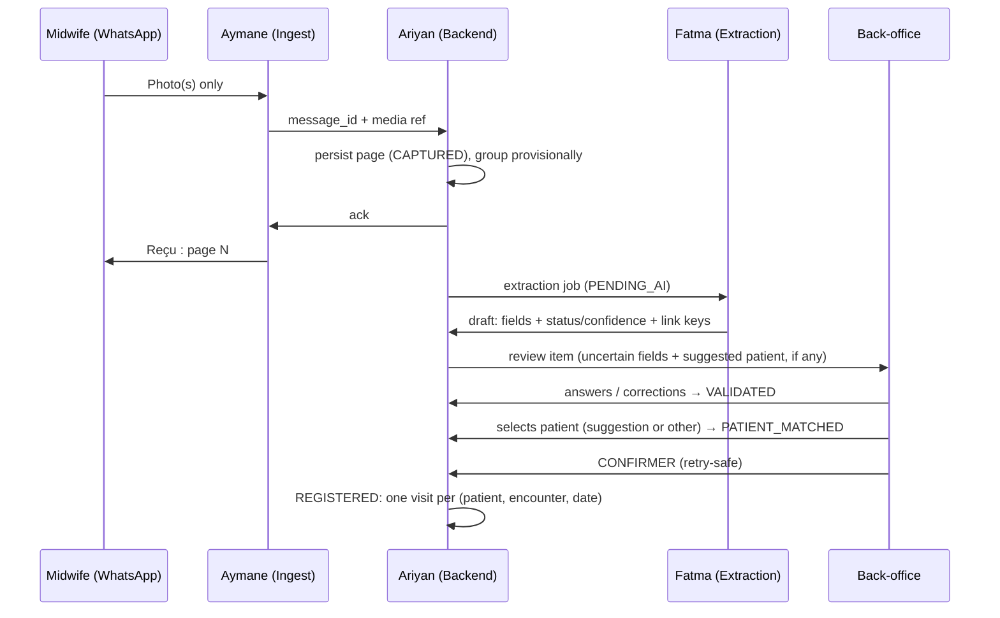

# DayOne — The Offline Midwife

**Team:** Fatma · Aymane · Ariyan  
**Challenge:** Turn paper maternal registry photos into structured, verified, visit-linked digital records.  
**Operating model:** Midwives **only send photos** on WhatsApp; the **platform tracks women** over time; **back-office** handles verification and match decisions (see `docs/operating-model.md`).  
**References:** `consignes-fr-en.pdf` (authoritative rules), `docs/operating-model.md`, `docs/schema.md`, `docs/identity-strategy.md`, `Extra Info CodeML Hackathon.docx`, `manifest.json`, `data/Paper Registry/`, `data/maternal_registry_synthetic.csv` / `.xlsx`

**Out of scope:** Clinical prediction, triage, diagnosis, treatment recommendations.

**Checkbox rule:** `[x]` only when the item is in the code, with the evidence (file or test) next to it. Anything partial stays `[ ]`, with a note saying what exists.

---

## Current state (branch `p-ocr-camera`, runs today)

`python3 -m dayone` starts the app at <http://127.0.0.1:8000> (sign in with the admin password printed at first start). Demo flow: photo (dataset page or camera), acknowledgment, draft, back-office correction, patient selection, confirmation, patient timeline, central-registry sync; plus offline capture, retake and manual entry. Tests: `python3 -m unittest discover -s tests -v` (80 tests).

The WhatsApp side is a **simulator** in the browser; a Cloud API adapter (`dayone/whatsapp.py`) is built and tested against a fake Graph API but not connected to a live Meta account. Extraction is either the fixture lookup or local **Tesseract OCR of the specimen booklets** (`--extractor tesseract`, only `data/Paper Registry/dossiers_specimen_*`).

| Owner | MVP scope | Acceptance | State |
|-------|-----------|------------|-------|
| **Fatma** | One layout (`ma-fiche-surveillance-grossesse-v1`), 12 fields, success + uncertain fixtures | Both fixtures validate against the shared schema | Done: `tests/test_schema.py`. Fixture values are illustrative, not ground truth |
| **Ariyan** | Store documents/drafts; review, correction, confirmation, timeline operations | Confirmation saves exactly one visit, including on retries | Done: `dayone/service.py`, `test_confirm_retry_saves_visits_once` |
| **Aymane** | Simulated photo ingest + back-office review screen | Reviewer corrects a field, chooses a patient, confirms, sees the saved visit | Done: `dayone/static/`, checked end to end in the browser |

### Decisions that resolve the review comments

1. **Verification gate:** auto-link only *suggests* a candidate. `PATIENT_MATCHED` needs a reviewer click, and `REGISTERED` needs **CONFIRMER**. `NEW` is never automatic (`test_photo_to_timeline` asserts that no selection exists before the click).
2. **Document ≠ visit:** keys identify the woman; a visit is one grid column identified by (`patient_id`, `encounter_type`, `visit_date`). A re-photographed column gives `EXISTS_SAME` (no new visit) or `EXISTS_DIFFERENT` (reviewer chooses update or keep).
3. **Multipage grouping is provisional:** grouped by sender plus an 8 s window. Back-office can split or regroup pages, and the affected drafts are re-extracted. Grouping becomes `CONFIRMED` at registration.
4. **Offline scope:** no companion app. Phone-side buffering is WhatsApp's own outbox, which is not our code. Our durable queue is the platform database. See `docs/operating-model.md` § Offline.
5. **Conversational requirement:** the instructions put verification with the midwife. Back-office review is a **declared deviation**, not compliance. See `docs/operating-model.md`.

---

## Blockers and open gaps (keep visible until resolved)

| # | Gap | Why it matters | Owner | State |
|---|-----|----------------|-------|-------|
| 1 | **Organizer confirmation in writing:** back-office verification instead of the midwife | Instructions say "verified by the midwife"; 20-pt rubric item at risk | All | Not obtained (verbal only) |
| 2 | **Organizer confirmation in writing:** WhatsApp's outbox counts as the phone-side offline queue | Instructions require encrypted local storage and an offline-capture demo | All | Not obtained |
| 3 | **Encryption at rest**: database, stored media | "Local storage on the device must be encrypted" (consignes §4) | Ariyan | **Done** (AES-256-GCM): `dayone/crypto.py`, `store.py`, `media.py`; `tests/test_media_retake.py` (`EncryptionTest`). Key next to the data unless `DAYONE_DATA_KEY` is set; no key rotation |
| 4 | **Authentication and roles** on every `/api/*` route | Reviewer identity and destructive routes | Ariyan + Aymane | **Done**: `dayone/auth.py`, `server.py` (sessions, roles, CSRF header); `tests/test_http.py` |
| 5 | **Offline-capture demo** ("an offline capture, the return of connectivity") | Required demo scenario | Ariyan + Aymane | **Done as simulation**: encrypted IndexedDB outbox on the simulated phone (`static/app.js`), checked in a browser; capture time kept (`test_capture_time_is_kept_and_validated`) |
| 6 | **`SYNCED`** / central sync | Lifecycle state in the instructions | Ariyan | **Done**: `dayone/sync.py`, `SYNCED` / `SYNC_FAILED` with back-off; `tests/test_sync.py`. No real central registry exists; an encrypted local file stands in |
| 7 | **Retake photo** | Rubric item (Confirm / Edit / **Retake**) | Aymane | **Done**: reviewer or automatic request, page replaced by the next photo; `RetakeTest` |
| 8 | **Real extractor** | 30-pt extraction criterion | Fatma | **Done for the specimen booklets**: `dayone/live_ocr.py`, `specimen_ocr.py`; 0 FALSE-KNOWN, 33 % of written values KNOWN on 10 patients (`eval/compare_ocr.py`). Ground truth unverified |
| 9 | **Real WhatsApp integration** | Bonus item; needed for a real pilot | Aymane | **Adapter built, not live**: `dayone/whatsapp.py`, `tests/test_whatsapp.py` (fake Graph API). Needs a Meta app, number and public HTTPS |
| 10 | **HTTPS** | Transport security | Ariyan | **Option implemented**: `--tls-cert/--tls-key`, Secure cookies, HSTS. Not covered by a test |

---

## What judges care about (100 pts)

| Criterion | Points | Primary owner | Current state |
|-----------|--------|---------------|---------------|
| Extraction quality (field accuracy on test set) | 30 | **Fatma** | Tesseract extractor on 10 specimen patients: 120/369 values KNOWN and right, 0 FALSE-KNOWN, 0 missed; ground truth unverified, no held-out set |
| Uncertainty (status + confidence, agent shows doubt) | 20 | **Fatma** + **Aymane** | Confidence = share of agreeing OCR readings; reason flags on every doubtful value; UI asks one question at a time |
| Conversational review (Confirm / Edit / Retake, follow-ups, multipage) | 20 | **Aymane** + **Ariyan** | Confirm / Edit / Retake / manual entry done; **still at risk**: reviewer is staff, not the midwife |
| Offline robustness (queue, states, sync after reconnect) | 15 | **Ariyan** (+ **Aymane**) | Durable encrypted queue, simulated encrypted phone outbox, `SYNCED` / `SYNC_FAILED` with retries |
| Patient linking + privacy (code-based link, no direct IDs stored) | 10 | **Ariyan** | Linking, encryption at rest, login and roles, anonymized sync and export |
| Code quality + README | 5 | **All** | README, 80 tests, CI workflow (not yet run on GitHub) |

---

## Team ownership

| Person | Role | Main deliverable |
|--------|------|------------------|
| **Fatma** | AI / document extraction | Image → draft JSON with **status**, **confidence**, and **link keys** from paper |
| **Aymane** | WhatsApp ingest + back-office review | WhatsApp channel (photos + ack; simulator today); review/match UI for staff |
| **Ariyan** | Backend / patient registry / sync | Longitudinal profiles, patient suggestions, review queue, idempotency, encryption |

---

## Core user flow

### Midwife (WhatsApp — capture only; simulated in the MVP)

1. Sends registry photo(s); may send multiple pages in one session.
2. Receives one acknowledgment per page: *« Reçu : page N. Merci, le traitement est en cours. »* In the MVP the acknowledgment is stored and shown in the simulated thread; nothing is sent to a real phone.
3. No field review, no patient match, no tracking tasks in chat.

### Platform (automatic + back-office)

1. Ingest persists the page (`CAPTURED`) **before** returning the acknowledgment; a duplicate `message_id` is ignored.
2. Pages are grouped provisionally (sender + window); then the document is queued for extraction (`PENDING_AI`).
3. **Fatma**'s extractor returns a draft with status and confidence per field, plus the link keys read from paper.
4. **Back-office** (Aymane's UI) answers each uncertain field with **Confirmer / Corriger / Illisible / Non renseigné**, which leads to `VALIDATED`.
5. **Ariyan**'s backend lists candidates and **suggests** one when keys match strongly. The reviewer **selects** `[Patiente N] [Nouvelle patiente] [Je ne sais pas]`, which leads to `PATIENT_MATCHED`.
6. The summary shows each visit as new, already registered, or differing. The reviewer presses **CONFIRMER**, which leads to `REGISTERED` (one visit per encounter, idempotent). `SYNCED` is not implemented.
7. **Next document** for the same woman: same keys give the same suggested patient, and already-registered dates are not duplicated.

### Two-layer architecture (from Extra Info + consignes), as decided

| Layer | Requires internet | Where in our design |
|-------|-------------------|---------------------|
| **Layer 1 — Capture** | No (phone side) | WhatsApp's own outbox on the phone (not ours, not demonstrated); then our durable intake queue (`CAPTURED` / `PENDING_AI` in the platform database) |
| **Layer 2 — Online services** | Yes | **Fatma** extraction, **Ariyan** registry & matching, **back-office** review |

> **Privacy:** Fiche photos only—no ID cards. Do not store name/phone/address from forms. Link visits using **`registry_file_number`** + **`midwife_patient_code`** read from the fiche.

Every path goes through the reviewer; there is no branch where a confident auto-link registers on its own.

---

## Day 0 agreements

- [x] **One document layout:** `ma-fiche-surveillance-grossesse-v1`, as printed in the specimen booklets (page 1 cover, page 3 visit grid), in `docs/schema.md` and `dayone/schema.py` (`LAYOUT_ID`).
- [x] **12-field contract** (below), in `dayone/schema.py` (`test_field_catalog_has_twelve_fields`).
- [x] **Shared JSON schema:** `docs/schema.md` + `validate_draft` (`test_fixtures_follow_schema`).
- [x] **Field status enum** (from consignes): `KNOWN`, `UNKNOWN`, `NOT_PROVIDED`, `ILLEGIBLE`, `NOT_APPLICABLE`, `NEEDS_REVIEW`. Kept separate from **verification** (`UNVERIFIED` / `CONFIRMED` / `CORRECTED`) with an append-only `corrections[]` (`test_photo_to_timeline` checks the correction history).
- [x] **Record lifecycle:** `CAPTURED` → `PENDING_AI` → `AI_PROCESSED` → `NEEDS_REVIEW` → `VALIDATED` → `PATIENT_MATCHED` → `REGISTERED`, plus `PROCESSING_FAILED` and `DUPLICATE_SUSPECTED`. `SYNCED`, `SYNC_FAILED` and `MANUAL_REVIEW_REQUIRED` are reserved and unused.
- [x] **Patient linking:** facility-scoped keys, suggestion only, `[Patiente N] [Nouvelle patiente] [Je ne sais pas]`, in `dayone/linking.py` (`test_unsure_parks_document`, `test_new_patient_with_registered_key_is_rejected`).
- [x] **Verifier role decided:** back-office staff, a declared deviation from the instructions.
- [ ] **Organizer confirmation in writing** for the verifier role and the WhatsApp outbox (blockers 1–2).
- [x] **Privacy.** Fiche-only input; the validator rejects any field outside the 12; request logs contain paths only; OCR records PII labels as `NOT_EXTRACTED` (`RealSpecimenTest`); encryption at rest (`EncryptionTest`); login and roles (`tests/test_http.py`); sync and export carry no link keys (`test_registered_document_is_synced_with_an_anonymized_payload`, `test_export_has_values_but_no_link_keys`).
- [x] **Offline strategy decided:** no companion app. Durable queue = platform database; phone-side buffering = WhatsApp outbox. The gaps are blockers 2, 3, 5 and 6.

### MVP field contract (agreed, 12 fields)

Source of truth: `docs/schema.md` and `dayone/schema.py`.

| Field | Scope | Type / unit | Source on the fiche |
|-------|-------|-------------|---------------------|
| `registry_file_number` | document | digits (link key) | Cover, *N° de la fiche* |
| `midwife_patient_code` | document | code `A-Z 0-9 -` (link key) | Cover, code written by the midwife (`CM: 164125`) |
| `facility_name` | document | text | Cover, establishment name |
| `last_menstrual_period` | document | date | *DDR* |
| `visit_date` | encounter | date (**required**) | *Venue le* |
| `gestational_age_days` | encounter | integer, days | *Âge probable de la grossesse* (`16SA+3j` → 115) |
| `weight_kg` | encounter | decimal, kg | *Poids* |
| `systolic_bp_mmhg` | encounter | integer, mmHg | *TA* (`12/7` → 120) |
| `diastolic_bp_mmhg` | encounter | integer, mmHg | *TA* (`12/7` → 70) |
| `fundal_height_cm` | encounter | integer, cm | *HU* |
| `syphilis_test` | encounter | `NEGATIVE` / `POSITIVE` | *Syphilis (TPHA/VDRL)* |
| `hiv_test` | encounter | `NEGATIVE` / `POSITIVE` | *Sérologie VIH* |

Each encounter is one column of the visit grid (slots `T1_V1`–`T1_V3`, `T2_V1`–`T2_V3`, `M7`–`M9`, or `MANUAL`). Never extracted: patient name, husband's name, national ID, phone, address.

### Registry sections beyond v1 (not started)

Use `data/Paper Registry/dossiers_specimen_10_patientes.pdf` and the specimen PNGs. Any new field must be added to `docs/schema.md` and `dayone/schema.py` first. Sections:

1. Medical & family history
2. Obstetric history
3. Delivery
4. Postpartum & newborn

### Day 0 questions (resolved)

| # | Question | Decision |
|---|----------|----------|
| A | Primary match key on fiche? | `registry_file_number` + `midwife_patient_code`, scoped to the facility; never the name |
| B | No code on page? | No suggestion; reviewer picks a patient or creates one (flag `NO_LINK_KEY`) |
| C | Who sees patient timeline? | Back-office; midwife has no tracker UI |
| D | Multipage in one session? | Yes: provisional document, split/regroup in back-office |
| E | Re-digitize same booklet? | Visit identity by date: `EXISTS_SAME` skipped, `EXISTS_DIFFERENT` → update/keep |
| F | UI language? | French (acknowledgment + back-office); `raw_text` preserved |
| G | AI unavailable? | Documents wait in `PENDING_AI`; manual entry only after `PROCESSING_FAILED` (see open items) |
| H | Follow-up questions? | Yes: back-office must answer every `NEEDS_REVIEW` / `ILLEGIBLE` field |

Internal IDs (`DOC-`, `PAGE-`, `PAT-`, `VIS-000001`) are generated sequentially and never derived from personal data (`dayone/store.py`, `next_id`).

---

## Milestones (whole team)

| Stage | Goal | State |
|-------|------|-------|
| **1. Contract & setup** | Shared schema, identity strategy, fixtures | Done: `docs/schema.md`, `docs/identity-strategy.md`, `fixtures/` |
| **2. Core MVP** | Photo → draft → back-office review → **CONFIRMER** → visit on timeline | Done with fixtures and the simulator: `test_photo_to_timeline`, browser walkthrough |
| **3. Reliability** | Corrections, duplicate webhooks, retries, restart | Done: idempotency, concurrency, restart, extraction crash, bad photo (automatic retake) tested |
| **4. Challenge depth** | Real extractor, Retake, encryption, auth, offline-capture demo, real WhatsApp | Done except a live WhatsApp account (blocker 9) and organizer confirmations (1–2) |
| **5. Submission** | README, architecture, extraction metrics, demo script | Done: README with metrics, architecture diagram and demo script; ground truth still to verify |

---

## Fatma — AI / document extraction

### Goals

- Schema-driven extraction (not a generic OCR dump).
- Per-field **status** + **confidence**; `null` when illegible. **Never invent** clinical values.
- Evaluation on held-out images against verified ground truth.

### Implemented

- [x] Layout + 12-field map: `docs/schema.md`, `dayone/schema.py`.
- [x] Success fixture (`fixtures/success_extraction.json`, specimen pages 01 + 03) and uncertain fixture (`fixtures/sample_extraction.json`, pages 01–03, one `NEEDS_REVIEW` + one `ILLEGIBLE`): `test_sample_has_exactly_two_uncertain_fields`, `test_success_fixture_has_no_blocking_field`.
- [x] Extractor interface wired to the queue: the worker calls `extract(page_refs)` on `PENDING_AI` documents and validates every result with `validate_draft`. An `ExtractionError` leads to `PROCESSING_FAILED`, while an unexpected exception leaves the document queued for retry (`dayone/service.py`, `process_document`).
- [x] Contract guards against silent certainty: the validator rejects unverified `KNOWN` below 0.75 confidence, out-of-range `KNOWN` values, and values on missing statuses (`test_validator_rejects_silent_known_below_threshold`, `test_validator_rejects_value_on_missing_status`).

### Done on `p-ocr-camera`

- [x] Real extractor behind `extract(page_refs)`: Tesseract, specimen pages only, every visit column (`dayone/live_ocr.py`, `dayone/specimen_ocr.py`; `RealSpecimenTest`). Four readings must agree (3 of 4, none against) and pass booklet consistency checks before `KNOWN`.
- [x] Plausibility handling: implausible or contradictory values become `NEEDS_REVIEW` with reason flags (`ConsistencyTest`); a contract-breaking draft fails as `INVALID_EXTRACTION` (`test_draft_breaking_the_contract_fails_explicitly`).
- [x] PII detection: printed identifier labels recorded as `NOT_EXTRACTED` (`RealSpecimenTest`).
- [x] Image-quality gate: unusable photo → automatic retake request, `MANUAL_REVIEW_REQUIRED` (`test_unusable_photo_triggers_an_automatic_retake_message`).
- [x] Evaluation: `eval/compare_ocr.py` against `eval/ground_truth.json` (10 patients, 55 visits), in CI.
- [x] Fixtures moved to specimen patient 1 (`fixtures/`), values from the ground truth.

### Open

- [ ] **Verify `eval/ground_truth.json` by a person** (transcribed by eye, unverified), and add a held-out set: the agreement thresholds were chosen on the same 10 patients.
- [ ] Reliable `registry_file_number` and `facility_name`: handwriting goes to review in 9–10 of 10 booklets.
- [ ] Preprocessing for real phone photos (deskew, perspective): only the fixed specimen scan is handled. Line removal inside cells is done.
- [ ] Ticked boxes (facility type, blood group): `eval/mark_detection_demo.py` prototype only; needs schema fields and decision 4.
- [ ] Field map beyond v1 (`docs/field-mapping.md` does not exist yet).

### Handoff

| Deliverable | State |
|-------------|-------|
| Extractor interface (`extract(page_refs)` → draft) | Exists in-process (`dayone/extraction.py`); no HTTP endpoint |
| Fixtures | 2 page sets; more needed |
| Eval script + metrics | Done: `eval/compare_ocr.py`, table in README |
| Failure catalog (blur, empty checkbox, Arabic) | Partly: per-field reason flags (`docs/schema.md`); no catalog of photo defects |

**Done when:** uncertain or missing fields always arrive as `NEEDS_REVIEW` / `ILLEGIBLE` / `NOT_PROVIDED`, never as silent `KNOWN`, on real images. Met on the 10 specimen booklets (0 FALSE-KNOWN, 0 missed); not tested on real phone photos.

---

## Aymane — WhatsApp ingest + back-office review

### Goals

- **WhatsApp:** capture-only channel for midwives. Simulator today; real Cloud API later.
- **Back-office UI:** carries the rubric's conversational review mechanics (confirm, edit, retake request, manual entry, multipage, patient match), with staff as the actor. This is a declared deviation from "verified by the midwife".

### Simulator (implemented, not real WhatsApp)

- [x] Phone panel picks images from `data/Paper Registry/` and posts `{sender_id, message_id, media_ref}` to `/api/whatsapp/messages` (`dayone/static/app.js`, `dayone/server.py`).
- [x] One acknowledgment per page, stored in the `messages` table and shown in the simulated thread (`test_photo_to_timeline`).
- [x] Duplicate `message_id` ignored, with no second acknowledgment; there is a replay button for the demo (`test_webhook_replay_is_ignored`).
- [x] Unregistered sender refused (`test_unknown_sender_is_refused`). The only sender is the seeded demo number (`DEMO_SENDER`).
- [x] Multipage grouping by sender + window (`test_pages_after_window_start_a_new_document`).
- [x] Midwives are never asked to confirm fields or choose patients (by design: no such message exists).

### Real WhatsApp integration (built, not live)

- [x] Meta Cloud API webhook: verify token, `X-Hub-Signature-256` check, secrets in environment variables (`dayone/whatsapp.py`; `test_webhook_rejects_unsigned_calls`).
- [x] Media download from the Graph API into encrypted storage (`test_image_is_downloaded_encrypted_and_ingested_once`).
- [x] Acknowledgments and retake requests sent through the Cloud API with retries (`test_acknowledgments_are_sent_and_retried`).
- [x] Non-image messages: polite reply; `fin` closes a session (`test_fin_closes_the_open_group_of_pages`).
- [x] Sender registration (number → facility), admin only (`test_admin_registers_a_sender_and_a_user`).
- [x] **Retake request** (blocker 7): *« Merci de reprendre la photo de la page N »*, next photo replaces the page (`RetakeTest`).
- [x] Camera capture on the simulated phone (`POST /api/media`; `test_camera_photo_is_ingested_like_any_page`).
- [ ] Connect a live Meta app and business number (needs public HTTPS).

### Back-office review (implemented)

- [x] Queue of all documents with status, including `PROCESSING_FAILED` and `DUPLICATE_SUSPECTED` (`GET /api/documents`, queue panel).
- [x] Uncertainty visible: the question shows the raw text, confidence and flags, and the grid shows status + confidence for every field.
- [x] One question at a time: **Confirmer / Corriger / Illisible / Non renseigné**, with server-side validation (`test_illegible_field_needs_explicit_answer`, `test_invalid_correction_is_rejected_without_change`, `test_required_visit_date_cannot_be_marked_missing`).
- [x] Patient question with the suggestion highlighted but not selected (`test_photo_to_timeline`, `test_unsure_parks_document`).
- [x] Summary + **CONFIRMER**, which leads to `REGISTERED`, with update/keep for differing existing visits (`test_changed_value_on_existing_visit_requires_decision`).
- [x] Split / regroup pages (`test_split_and_regroup_pages`).
- [x] Manual entry after a failed extraction, for one encounter (`test_manual_entry_after_failed_extraction`).
- [x] "IA disponible" toggle to simulate an AI outage.

### Back-office, done on `p-ocr-camera`

- [x] Manual entry while AI is unavailable, and with several visits (`test_manual_entry_while_ai_is_down_with_several_visits`).
- [x] Reviewer login and roles (`tests/test_http.py`).

### Open (back-office)

- [ ] Optional: notify the facility when review is complete (not via the midwife chat).

### Example dialogues (French, as implemented)

**Midwife thread (simulated)**

| Speaker | Message |
|---------|---------|
| Sage-femme | *[Photo dossiers_specimen_10_patientes-01.png]* |
| Bot | Reçu : page 1. Merci, le traitement est en cours. |

**Back-office**

| Speaker | Message |
|---------|---------|
| Système | Date de visite — 9e mois. J'ai lu « 1?/01/2026 », soit 13/01/2026. Confiance : 42 %. |
| Agent | Corriger : 18/01/2026 |
| Système | Quelle patiente ? Patiente 1 : PAT-000001 (proposée) |
| Agent | Patiente 1 : PAT-000001 → CONFIRMER l'enregistrement |
| Système | Enregistré : VIS-000004, VIS-000005, VIS-000006 créées. |

---

## Ariyan — Backend / records / sync / privacy

### Goals

- **Product center:** longitudinal **patient registry** (visit timeline, documents, link keys).
- Durable queue, lifecycle, suggestions + review queue, idempotency, then encryption and auth.

### Implemented

- [x] Data model in SQLite (`dayone/store.py`): `facilities`, `senders`, `documents` (status, revision, provisional grouping, draft, selection, registration), `pages` (unique `source_message_id`, SHA-256), `patients` (facility-unique keys), `visits` (unique patient + encounter + date, history), `messages`, `events`. There are no separate job or media tables: the queue is the document status, and media are references to the read-only dataset.
- [x] Back-office API (`dayone/server.py`): list/get documents, review field, select patient, confirm, manual entry, move page, list patients, timeline.
- [x] Raw + normalized value, confidence, status, flags, correction history, and verifier + timestamp are kept per field in the draft and copied to the visit; visit updates keep the previous values in `history_json`.
- [x] Facility-scoped linking; a strong match only suggests; never auto-create (`dayone/linking.py`).
- [x] Patient timeline API: `GET /api/patients/{id}/timeline`.
- [x] Idempotency: unique `source_message_id`, confirm replay returns the stored result, unique visit index (`test_webhook_replay_is_ignored`, `test_confirm_retry_saves_visits_once`).
- [x] Confirmation in one transaction (`BEGIN IMMEDIATE`).
- [x] Optimistic concurrency with `expected_revision` (`test_stale_revision_is_rejected`).
- [x] Durable intake queue: `CAPTURED` / `PENDING_AI` survive AI outages and restarts (`test_queue_waits_while_ai_unavailable_and_survives_restart`).
- [x] Re-digitization: same booklet → `EXISTS_SAME` / `EXISTS_DIFFERENT` (`test_rephotographed_booklet_creates_no_new_visit`).
- [x] No PHI in HTTP logs: request logs contain the path only, never query strings or bodies (`Handler.log_request`).

### Done on `p-ocr-camera`

- [x] **Encryption at rest** for the database and stored media; key from `DAYONE_DATA_KEY` (`EncryptionTest`).
- [x] **Authentication and roles** on all `/api/*` routes and `/media/` (`tests/test_http.py`).
- [x] **HTTPS** option (`--tls-cert`, `--tls-key`); not covered by a test.
- [x] Media storage for photos: encrypted, linked to page and capture time, session-only download (`dayone/media.py`).
- [x] `SYNCED` / `SYNC_FAILED` with exponential back-off (`tests/test_sync.py`).
- [x] HTTP API for an external extractor (`HttpExtractor`, `tests/test_export_extractor.py`).
- [x] Retention: no temporary files (photos decrypted in memory, sent to Tesseract on stdin); `--purge-media DAYS` (`test_synced_camera_photos_are_purged_after_the_retention_period`).
- [x] Test for a crash during extraction (`test_crash_during_extraction_keeps_the_document_queued`).
- [x] Anonymized JSON/CSV export (`test_export_has_values_but_no_link_keys`).

### Open

- [ ] Notification job after registration.
- [ ] Key rotation, and keeping the data key outside `var/` in deployment.

### Offline / recovery matrix

| Situation | Expected behavior | Evidence |
|-----------|-------------------|----------|
| Phone offline | Simulated phone: encrypted IndexedDB outbox, sent in capture order on reconnect; real WhatsApp: its own outbox | Browser walkthrough; replays deduplicated (`test_webhook_replay_is_ignored`) |
| WhatsApp cloud unreachable | Inbound delayed; processed when delivered | Not applicable until real integration |
| AI unavailable | Documents stay `PENDING_AI` ("IA indisponible" shown); processed when it returns | `test_queue_waits_while_ai_unavailable_and_survives_restart`, UI toggle |
| Backend restart | Queue and drafts intact | Same test |
| Crash during extraction | Document stays `PENDING_AI`, retried on the next tick | `test_crash_during_extraction_keeps_the_document_queued` |
| Central registry down | `SYNC_FAILED`, retried with back-off, `SYNCED` on recovery | `test_failure_is_retried_with_backoff_then_recovers` |
| Duplicate webhook | One page, no second acknowledgment | `test_webhook_replay_is_ignored` |
| Confirm retried | Stored result returned, no new visit | `test_confirm_retry_saves_visits_once` |

---

## Shared integration tasks

- [x] Repo layout for the MVP: one standard-library package `dayone/`; splitting into services is deferred.
- [x] CI: tests, `git diff --check` and the OCR evaluation on every push (`.github/workflows/ci.yml`; not yet run on GitHub).
- [x] README: run, test, demo steps, code map, known limitations (`README.md`).
- [x] README: architecture diagram and environment variables.
- [x] Demo script in `README.md`, including offline capture → return of connectivity, retake and sync.

---

## Evaluation prep (Fatma leads, all contribute)

- [ ] Hold-out image set with **verified** ground truth. 10 patients (80 pages) are transcribed in `eval/ground_truth.json` but not verified, and they were also used to choose the thresholds.
- [x] Table: per-field KNOWN-right, FALSE-KNOWN, review, missed (README; `eval/compare_ocr.py --markdown`). Confidence calibration not measured.
- [x] Extraction limitations in the README.

---

## Repo assets (do not modify originals)

| Asset | Use |
|-------|-----|
| `consignes-fr-en.pdf` | Full rules, statuses, lifecycle, grading (**source of truth**) |
| `Extra Info CodeML Hackathon.docx` | Two-layer offline/online design, V1 scope, workflow Q&A |
| `data/Paper Registry/*` | Specimen images + `dossiers_specimen_10_patientes.pdf` (10 patients × 8 pages). The sample fiche photos `1-1.jpg`…`1-5.jpg` were removed on `p-ocr-camera`. The app only reads these files |
| `data/maternal_registry_synthetic.csv` | Ground-truth-style table, **200 rows** (+ header) |
| `data/maternal_registry_synthetic.xlsx` | Same dataset as CSV (keep both read-only) |
| `manifest.json` | **132** listed files with SHA-256; do not modify listed assets |
| `docs/operating-model.md` | Roles, offline scope, conversational-requirement check |
| `docs/schema.md`, `docs/identity-strategy.md` | Shared contracts |
| `tasks.md` | Team backlog (Fatma / Aymane / Ariyan) |

---

## Quick links

- [WhatsApp Cloud API docs](https://developers.facebook.com/docs/whatsapp/cloud-api)
- [Meta WhatsApp API examples](https://github.com/fbsamples/whatsapp-api-examples)
- Dataset folder (organizers): [Google Drive](https://drive.google.com/drive/folders/1RtBBVDkPFfMiouPEry2Ogzu26Odh8JUF?usp=sharing)
