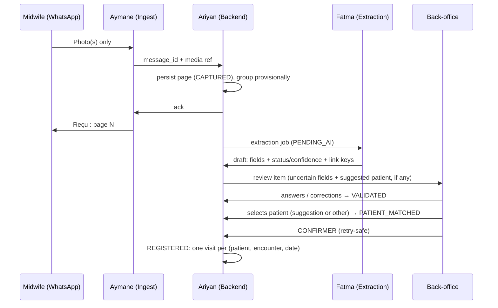

# DayOne — The Offline Midwife

**Team:** Fatma · Aymane · Ariyan  
**Challenge:** Turn paper maternal registry photos into structured, verified, visit-linked digital records.  
**Operating model:** Midwives **only send photos** on WhatsApp; the **platform tracks women** over time; **back-office** handles verification and match decisions (see `docs/operating-model.md`).  
**References:** `consignes-fr-en.pdf` (authoritative rules), `docs/operating-model.md`, `docs/schema.md`, `docs/identity-strategy.md`, `Extra Info CodeML Hackathon.docx`, `manifest.json`, `data/Paper Registry/`, `data/maternal_registry_synthetic.csv` / `.xlsx`

**Out of scope:** Clinical prediction, triage, diagnosis, treatment recommendations.

**Checkbox rule:** `[x]` only when the item is in the code, with the evidence (file or test) next to it. Anything partial stays `[ ]`, with a note saying what exists.

---

## Current MVP (fixture-driven, runs today)

`python -m dayone` starts the app at <http://127.0.0.1:8000>. Demo flow: photo, acknowledgment, draft, back-office correction, patient selection, confirmation, patient timeline. Tests: `python -m unittest discover -s tests -v` (24 tests).

The WhatsApp side is a **simulator**: a phone panel in the browser posts JSON to `/api/whatsapp/messages`. There is no Meta Cloud API integration yet. The extractor is a **fixture lookup**, not a model.

| Owner | MVP scope | Acceptance | State |
|-------|-----------|------------|-------|
| **Fatma** | One layout (`ma-fiche-surveillance-grossesse-v1`), 12 fields, success + uncertain fixtures | Both fixtures validate against the shared schema | Done: `tests/test_schema.py`. Fixture values are illustrative, not ground truth |
| **Ariyan** | Store documents/drafts; review, correction, confirmation, timeline operations | Confirmation saves exactly one visit, including on retries | Done: `dayone/service.py`, `test_confirm_retry_saves_visits_once` |
| **Aymane** | Simulated photo ingest + back-office review screen | Reviewer corrects a field, chooses a patient, confirms, sees the saved visit | Done: `dayone/static/`, checked end to end in the browser |

### Decisions that resolve the review comments

1. **Verification gate:** auto-link only *suggests* a candidate. `PATIENT_MATCHED` needs a reviewer click, and `REGISTERED` needs **CONFIRMER**. `NEW` is never automatic (`test_photo_to_timeline` asserts that no selection exists before the click).
2. **Document ≠ visit:** keys identify the woman; a visit is one grid column identified by (`patient_id`, `encounter_type`, `visit_date`). A re-photographed column gives `EXISTS_SAME` (no new visit) or `EXISTS_DIFFERENT` (reviewer chooses update or keep).
3. **Multipage grouping is provisional:** grouped by sender plus an 8 s window. Back-office can split or regroup pages, and the affected drafts are re-extracted. Grouping becomes `CONFIRMED` at registration.
4. **Offline scope:** no companion app. Phone-side buffering is WhatsApp's own outbox, which is not our code. Our durable queue is the platform database. See `docs/operating-model.md` § Offline.
5. **Conversational requirement:** the instructions put verification with the midwife. Back-office review is a **declared deviation**, not compliance. See `docs/operating-model.md`.

---

## Blockers and open gaps (keep visible until resolved)

| # | Gap | Why it matters | Owner | State |
|---|-----|----------------|-------|-------|
| 1 | **Organizer confirmation in writing:** back-office verification instead of the midwife | Instructions say "verified by the midwife"; 20-pt rubric item at risk | All | Not obtained (verbal only) |
| 2 | **Organizer confirmation in writing:** WhatsApp's outbox counts as the phone-side offline queue | Instructions require encrypted local storage and an offline-capture demo | All | Not obtained |
| 3 | **Encryption at rest**: SQLite database (drafts, visits, keys) and any stored media | "Local storage on the device must be encrypted" (consignes §4) | Ariyan | Not implemented: database is plain SQLite in `var/` |
| 4 | **Authentication and roles** on every `/api/*` route | Anyone who can reach the port can review, confirm, read timelines, or call `POST /api/demo/reset` (wipes the database). Reviewer identity is a free-text `X-Reviewer` header | Ariyan + Aymane | Not implemented; server binds to `127.0.0.1` by default |
| 5 | **Offline-capture demo** ("an offline capture, the return of connectivity") | Required demo scenario | Ariyan + Aymane | Not demonstrated. We only show the platform-side equivalent (AI outage, then recovery) |
| 6 | **`SYNCED`** / central sync | Lifecycle state in the instructions | Ariyan | Reserved, not implemented |
| 7 | **Retake photo** | Rubric item (Confirm / Edit / **Retake**) | Aymane | Not implemented |
| 8 | **Real extractor** | 30-pt extraction criterion | Fatma | Not started; `FixtureExtractor` only covers 2 page sets |
| 9 | **Real WhatsApp integration** | Bonus item; needed for a real pilot | Aymane | Not started (simulator only) |
| 10 | **HTTPS** | Transport security | Ariyan | Not implemented (plain HTTP on localhost) |

---

## What judges care about (100 pts)

| Criterion | Points | Primary owner | Current state |
|-----------|--------|---------------|---------------|
| Extraction quality (field accuracy on test set) | 30 | **Fatma** | No real extractor and no metrics yet |
| Uncertainty (status + confidence, agent shows doubt) | 20 | **Fatma** + **Aymane** | Contract, validator and UI done; confidence values come from fixtures |
| Conversational review (Confirm / Edit / Retake, follow-ups, multipage) | 20 | **Aymane** + **Ariyan** | **At risk**: reviewer is staff, not the midwife; Retake missing |
| Offline robustness (queue, states, sync after reconnect) | 15 | **Ariyan** (+ **Aymane**) | Platform queue durable; device-side offline and sync not done |
| Patient linking + privacy (code-based link, no direct IDs stored) | 10 | **Ariyan** | Linking done; encryption and auth missing |
| Code quality + README | 5 | **All** | README + tests done; no CI |

---

## Team ownership

| Person | Role | Main deliverable |
|--------|------|------------------|
| **Fatma** | AI / document extraction | Image → draft JSON with **status**, **confidence**, and **link keys** from paper |
| **Aymane** | WhatsApp ingest + back-office review | WhatsApp channel (photos + ack; simulator today); review/match UI for staff |
| **Ariyan** | Backend / patient registry / sync | Longitudinal profiles, patient suggestions, review queue, idempotency, encryption |

---

## Core user flow

### Midwife (WhatsApp — capture only; simulated in the MVP)

1. Sends registry photo(s); may send multiple pages in one session.
2. Receives one acknowledgment per page: *« Reçu : page N. Merci, le traitement est en cours. »* In the MVP the acknowledgment is stored and shown in the simulated thread; nothing is sent to a real phone.
3. No field review, no patient match, no tracking tasks in chat.

### Platform (automatic + back-office)

1. Ingest persists the page (`CAPTURED`) **before** returning the acknowledgment; a duplicate `message_id` is ignored.
2. Pages are grouped provisionally (sender + window); then the document is queued for extraction (`PENDING_AI`).
3. **Fatma**'s extractor returns a draft with status and confidence per field, plus the link keys read from paper.
4. **Back-office** (Aymane's UI) answers each uncertain field with **Confirmer / Corriger / Illisible / Non renseigné**, which leads to `VALIDATED`.
5. **Ariyan**'s backend lists candidates and **suggests** one when keys match strongly. The reviewer **selects** `[Patiente N] [Nouvelle patiente] [Je ne sais pas]`, which leads to `PATIENT_MATCHED`.
6. The summary shows each visit as new, already registered, or differing. The reviewer presses **CONFIRMER**, which leads to `REGISTERED` (one visit per encounter, idempotent). `SYNCED` is not implemented.
7. **Next document** for the same woman: same keys give the same suggested patient, and already-registered dates are not duplicated.

### Two-layer architecture (from Extra Info + consignes), as decided

| Layer | Requires internet | Where in our design |
|-------|-------------------|---------------------|
| **Layer 1 — Capture** | No (phone side) | WhatsApp's own outbox on the phone (not ours, not demonstrated); then our durable intake queue (`CAPTURED` / `PENDING_AI` in the platform database) |
| **Layer 2 — Online services** | Yes | **Fatma** extraction, **Ariyan** registry & matching, **back-office** review |

> **Privacy:** Fiche photos only—no ID cards. Do not store name/phone/address from forms. Link visits using **`registry_file_number`** + **`midwife_patient_code`** read from the fiche.

Every path goes through the reviewer; there is no branch where a confident auto-link registers on its own.

---

## Day 0 agreements

- [x] **One document layout:** `ma-fiche-surveillance-grossesse-v1` (cover `1-1.jpg` + visit grids `1-4.jpg` / `1-5.jpg`), in `docs/schema.md` and `dayone/schema.py` (`LAYOUT_ID`).
- [x] **12-field contract** (below), in `dayone/schema.py` (`test_field_catalog_has_twelve_fields`).
- [x] **Shared JSON schema:** `docs/schema.md` + `validate_draft` (`test_fixtures_follow_schema`).
- [x] **Field status enum** (from consignes): `KNOWN`, `UNKNOWN`, `NOT_PROVIDED`, `ILLEGIBLE`, `NOT_APPLICABLE`, `NEEDS_REVIEW`. Kept separate from **verification** (`UNVERIFIED` / `CONFIRMED` / `CORRECTED`) with an append-only `corrections[]` (`test_photo_to_timeline` checks the correction history).
- [x] **Record lifecycle:** `CAPTURED` → `PENDING_AI` → `AI_PROCESSED` → `NEEDS_REVIEW` → `VALIDATED` → `PATIENT_MATCHED` → `REGISTERED`, plus `PROCESSING_FAILED` and `DUPLICATE_SUSPECTED`. `SYNCED`, `SYNC_FAILED` and `MANUAL_REVIEW_REQUIRED` are reserved and unused.
- [x] **Patient linking:** facility-scoped keys, suggestion only, `[Patiente N] [Nouvelle patiente] [Je ne sais pas]`, in `dayone/linking.py` (`test_unsure_parks_document`, `test_new_patient_with_registered_key_is_rejected`).
- [x] **Verifier role decided:** back-office staff, a declared deviation from the instructions.
- [ ] **Organizer confirmation in writing** for the verifier role and the WhatsApp outbox (blockers 1–2).
- [ ] **Privacy.** Done: fiche-only input; the validator rejects any field outside the 12 (so no name or phone field can be stored); request logs contain paths only. Not done: PII detection in a real extractor, encryption at rest, authentication.
- [x] **Offline strategy decided:** no companion app. Durable queue = platform database; phone-side buffering = WhatsApp outbox. The gaps are blockers 2, 3, 5 and 6.

### MVP field contract (agreed, 12 fields)

Source of truth: `docs/schema.md` and `dayone/schema.py`.

| Field | Scope | Type / unit | Source on the fiche |
|-------|-------|-------------|---------------------|
| `registry_file_number` | document | digits (link key) | Cover, *N° de la fiche* |
| `midwife_patient_code` | document | code `A-Z 0-9 -` (link key) | Cover, code written by the midwife (`CM: 164125`) |
| `facility_name` | document | text | Cover, establishment name |
| `last_menstrual_period` | document | date | *DDR* |
| `visit_date` | encounter | date (**required**) | *Venue le* |
| `gestational_age_days` | encounter | integer, days | *Âge probable de la grossesse* (`16SA+3j` → 115) |
| `weight_kg` | encounter | decimal, kg | *Poids* |
| `systolic_bp_mmhg` | encounter | integer, mmHg | *TA* (`12/7` → 120) |
| `diastolic_bp_mmhg` | encounter | integer, mmHg | *TA* (`12/7` → 70) |
| `fundal_height_cm` | encounter | integer, cm | *HU* |
| `syphilis_test` | encounter | `NEGATIVE` / `POSITIVE` | *Syphilis (TPHA/VDRL)* |
| `hiv_test` | encounter | `NEGATIVE` / `POSITIVE` | *Sérologie VIH* |

Each encounter is one column of the visit grid (slots `T1_V1`–`T1_V3`, `T2_V1`–`T2_V3`, `M7`–`M9`, or `MANUAL`). Never extracted: patient name, husband's name, national ID, phone, address.

### Registry sections beyond v1 (not started)

Use `data/Paper Registry/dossiers_specimen_10_patientes.pdf` and the specimen PNGs. Any new field must be added to `docs/schema.md` and `dayone/schema.py` first. Sections:

1. Medical & family history
2. Obstetric history
3. Delivery
4. Postpartum & newborn

### Day 0 questions (resolved)

| # | Question | Decision |
|---|----------|----------|
| A | Primary match key on fiche? | `registry_file_number` + `midwife_patient_code`, scoped to the facility; never the name |
| B | No code on page? | No suggestion; reviewer picks a patient or creates one (flag `NO_LINK_KEY`) |
| C | Who sees patient timeline? | Back-office; midwife has no tracker UI |
| D | Multipage in one session? | Yes: provisional document, split/regroup in back-office |
| E | Re-digitize same booklet? | Visit identity by date: `EXISTS_SAME` skipped, `EXISTS_DIFFERENT` → update/keep |
| F | UI language? | French (acknowledgment + back-office); `raw_text` preserved |
| G | AI unavailable? | Documents wait in `PENDING_AI`; manual entry only after `PROCESSING_FAILED` (see open items) |
| H | Follow-up questions? | Yes: back-office must answer every `NEEDS_REVIEW` / `ILLEGIBLE` field |

Internal IDs (`DOC-`, `PAGE-`, `PAT-`, `VIS-000001`) are generated sequentially and never derived from personal data (`dayone/store.py`, `next_id`).

---

## Milestones (whole team)

| Stage | Goal | State |
|-------|------|-------|
| **1. Contract & setup** | Shared schema, identity strategy, fixtures | Done: `docs/schema.md`, `docs/identity-strategy.md`, `fixtures/` |
| **2. Core MVP** | Photo → draft → back-office review → **CONFIRMER** → visit on timeline | Done with fixtures and the simulator: `test_photo_to_timeline`, browser walkthrough |
| **3. Reliability** | Corrections, duplicate webhooks, retries, restart | Partly done: idempotency, concurrency and restart tested. Bad-photo handling needs the real extractor |
| **4. Challenge depth** | Real extractor, Retake, encryption, auth, offline-capture demo, real WhatsApp | Not started (blockers 3–10) |
| **5. Submission** | README, architecture, extraction metrics, demo script | Partly done: README and demo script exist; no metrics |

---

## Fatma — AI / document extraction

### Goals

- Schema-driven extraction (not a generic OCR dump).
- Per-field **status** + **confidence**; `null` when illegible. **Never invent** clinical values.
- Evaluation on held-out images against verified ground truth.

### Implemented

- [x] Layout + 12-field map: `docs/schema.md`, `dayone/schema.py`.
- [x] Success fixture (`fixtures/success_extraction.json`, `1-1.jpg` + `1-4.jpg`) and uncertain fixture (`fixtures/sample_extraction.json`, `1-1.jpg` + `1-5.jpg`, one `NEEDS_REVIEW` + one `ILLEGIBLE`): `test_sample_has_exactly_two_uncertain_fields`, `test_success_fixture_has_no_blocking_field`.
- [x] Extractor interface wired to the queue: the worker calls `extract(page_refs)` on `PENDING_AI` documents and validates every result with `validate_draft`. An `ExtractionError` leads to `PROCESSING_FAILED`, while an unexpected exception leaves the document queued for retry (`dayone/service.py`, `process_document`).
- [x] Contract guards against silent certainty: the validator rejects unverified `KNOWN` below 0.75 confidence, out-of-range `KNOWN` values, and values on missing statuses (`test_validator_rejects_silent_known_below_threshold`, `test_validator_rejects_value_on_missing_status`).

### Open

- [ ] Real extractor (OCR and/or vision model) behind the same `extract(page_refs)` interface, with its own `extractor` / `extractor_version`.
- [ ] Preprocessing only where it helps (crop, deskew, contrast), tested on degraded PNGs.
- [ ] Plausibility handling inside the extractor: emit `NEEDS_REVIEW` + `validation_flags` for implausible values. Today, a draft that breaks the contract is rejected outright as `INVALID_EXTRACTION`; this path has no test.
- [ ] PII detection in the pipeline: today `pii_detected` is written by hand in the fixtures.
- [ ] Reliable extraction of `registry_file_number` and `midwife_patient_code` from real images.
- [ ] Image-quality gate (would use the reserved `MANUAL_REVIEW_REQUIRED` state, plus Retake).
- [ ] More fixtures: partial page, PII-heavy page, other page sets. Only 2 page sets are covered; any other page set fails as `NO_FIXTURE_FOR_PAGE_SET`.
- [ ] Field map beyond v1 (`docs/field-mapping.md` does not exist yet).
- [ ] Replace illustrative fixture values with verified ground truth before computing accuracy.

### Handoff

| Deliverable | State |
|-------------|-------|
| Extractor interface (`extract(page_refs)` → draft) | Exists in-process (`dayone/extraction.py`); no HTTP endpoint |
| Fixtures | 2 page sets; more needed |
| Eval script + metrics | Not started |
| Failure catalog (blur, empty checkbox, Arabic) | Not started |

**Done when:** uncertain or missing fields always arrive as `NEEDS_REVIEW` / `ILLEGIBLE` / `NOT_PROVIDED`, never as silent `KNOWN`, on real images.

---

## Aymane — WhatsApp ingest + back-office review

### Goals

- **WhatsApp:** capture-only channel for midwives. Simulator today; real Cloud API later.
- **Back-office UI:** carries the rubric's conversational review mechanics (confirm, edit, retake request, manual entry, multipage, patient match), with staff as the actor. This is a declared deviation from "verified by the midwife".

### Simulator (implemented, not real WhatsApp)

- [x] Phone panel picks images from `data/Paper Registry/` and posts `{sender_id, message_id, media_ref}` to `/api/whatsapp/messages` (`dayone/static/app.js`, `dayone/server.py`).
- [x] One acknowledgment per page, stored in the `messages` table and shown in the simulated thread (`test_photo_to_timeline`).
- [x] Duplicate `message_id` ignored, with no second acknowledgment; there is a replay button for the demo (`test_webhook_replay_is_ignored`).
- [x] Unregistered sender refused (`test_unknown_sender_is_refused`). The only sender is the seeded demo number (`DEMO_SENDER`).
- [x] Multipage grouping by sender + window (`test_pages_after_window_start_a_new_document`).
- [x] Midwives are never asked to confirm fields or choose patients (by design: no such message exists).

### Real WhatsApp integration (not started)

- [ ] Meta Cloud API webhook: Meta payload format, verify token, signature check, HTTPS; secrets in environment variables.
- [ ] Media download from the Graph API into encrypted storage. Today, ingest only accepts files already in `data/Paper Registry/` (`resolve_media`).
- [ ] Send acknowledgments through the Cloud API. Today they are only stored in `messages`.
- [ ] Handle non-image messages (ignore text, optional `fin` to close a session).
- [ ] Sender registration (number → facility) instead of the seeded demo sender.
- [ ] **Retake request:** reviewer button that sends the midwife *« Merci de reprendre la photo de la page N »* (blocker 7).

### Back-office review (implemented)

- [x] Queue of all documents with status, including `PROCESSING_FAILED` and `DUPLICATE_SUSPECTED` (`GET /api/documents`, queue panel).
- [x] Uncertainty visible: the question shows the raw text, confidence and flags, and the grid shows status + confidence for every field.
- [x] One question at a time: **Confirmer / Corriger / Illisible / Non renseigné**, with server-side validation (`test_illegible_field_needs_explicit_answer`, `test_invalid_correction_is_rejected_without_change`, `test_required_visit_date_cannot_be_marked_missing`).
- [x] Patient question with the suggestion highlighted but not selected (`test_photo_to_timeline`, `test_unsure_parks_document`).
- [x] Summary + **CONFIRMER**, which leads to `REGISTERED`, with update/keep for differing existing visits (`test_changed_value_on_existing_visit_requires_decision`).
- [x] Split / regroup pages (`test_split_and_regroup_pages`).
- [x] Manual entry after a failed extraction, for one encounter (`test_manual_entry_after_failed_extraction`).
- [x] "IA disponible" toggle to simulate an AI outage.

### Open (back-office)

- [ ] Manual entry while AI is unavailable (today only after `PROCESSING_FAILED`), and for more than one encounter.
- [ ] Reviewer login. Today the reviewer name is free text sent as `X-Reviewer` (blocker 4).
- [ ] Optional: notify the facility when review is complete (not via the midwife chat).

### Example dialogues (French, as implemented)

**Midwife thread (simulated)**

| Speaker | Message |
|---------|---------|
| Sage-femme | *[Photo 1-1.jpg]* |
| Bot | Reçu : page 1. Merci, le traitement est en cours. |

**Back-office**

| Speaker | Message |
|---------|---------|
| Système | Date de visite — 9e mois. J'ai lu « 1?/12/25 », soit 12/12/2025. Confiance : 42 %. |
| Agent | Corriger : 19/12/2025 |
| Système | Quelle patiente ? Patiente 1 : PAT-000001 (proposée) |
| Agent | Patiente 1 : PAT-000001 → CONFIRMER l'enregistrement |
| Système | Enregistré : VIS-000004, VIS-000005, VIS-000006 créées. |

---

## Ariyan — Backend / records / sync / privacy

### Goals

- **Product center:** longitudinal **patient registry** (visit timeline, documents, link keys).
- Durable queue, lifecycle, suggestions + review queue, idempotency, then encryption and auth.

### Implemented

- [x] Data model in SQLite (`dayone/store.py`): `facilities`, `senders`, `documents` (status, revision, provisional grouping, draft, selection, registration), `pages` (unique `source_message_id`, SHA-256), `patients` (facility-unique keys), `visits` (unique patient + encounter + date, history), `messages`, `events`. There are no separate job or media tables: the queue is the document status, and media are references to the read-only dataset.
- [x] Back-office API (`dayone/server.py`): list/get documents, review field, select patient, confirm, manual entry, move page, list patients, timeline.
- [x] Raw + normalized value, confidence, status, flags, correction history, and verifier + timestamp are kept per field in the draft and copied to the visit; visit updates keep the previous values in `history_json`.
- [x] Facility-scoped linking; a strong match only suggests; never auto-create (`dayone/linking.py`).
- [x] Patient timeline API: `GET /api/patients/{id}/timeline`.
- [x] Idempotency: unique `source_message_id`, confirm replay returns the stored result, unique visit index (`test_webhook_replay_is_ignored`, `test_confirm_retry_saves_visits_once`).
- [x] Confirmation in one transaction (`BEGIN IMMEDIATE`).
- [x] Optimistic concurrency with `expected_revision` (`test_stale_revision_is_rejected`).
- [x] Durable intake queue: `CAPTURED` / `PENDING_AI` survive AI outages and restarts (`test_queue_waits_while_ai_unavailable_and_survives_restart`).
- [x] Re-digitization: same booklet → `EXISTS_SAME` / `EXISTS_DIFFERENT` (`test_rephotographed_booklet_creates_no_new_visit`).
- [x] No PHI in HTTP logs: request logs contain the path only, never query strings or bodies (`Handler.log_request`).

### Open

- [ ] **Encryption at rest** for the database and stored media, with keys from environment variables (blocker 3).
- [ ] **Authentication and roles** on all `/api/*` routes, including `POST /api/demo/reset` and `/media/` (blocker 4).
- [ ] **HTTPS** (blocker 10).
- [ ] Media storage for real WhatsApp images: encrypted copy, linked to page and capture time, role-restricted download.
- [ ] `SYNCED` / central sync worker, plus `SYNC_FAILED` (blocker 6).
- [ ] Notification job after registration.
- [ ] HTTP API for an external extractor (only the in-process interface exists).
- [ ] Retention policy for temporary files.
- [ ] Test for a crash during extraction (the code keeps the document in `PENDING_AI` and retries; no test yet).
- [ ] Export of anonymized JSON/CSV for a dashboard (optional bonus).

### Offline / recovery matrix

| Situation | Expected behavior | Evidence |
|-----------|-------------------|----------|
| Phone offline | WhatsApp's outbox holds the photos and delivers them on reconnect; replays deduplicated | **Not demonstrated**; outbox is not our code (blockers 2, 5) |
| WhatsApp cloud unreachable | Inbound delayed; processed when delivered | Not applicable until real integration |
| AI unavailable | Documents stay `PENDING_AI` ("IA indisponible" shown); processed when it returns | `test_queue_waits_while_ai_unavailable_and_survives_restart`, UI toggle |
| Backend restart | Queue and drafts intact | Same test |
| Crash during extraction | Document stays `PENDING_AI`, retried on the next tick | Code only (`process_document`); no test |
| Duplicate webhook | One page, no second acknowledgment | `test_webhook_replay_is_ignored` |
| Confirm retried | Stored result returned, no new visit | `test_confirm_retry_saves_visits_once` |

---

## Shared integration tasks

- [x] Repo layout for the MVP: one standard-library package `dayone/`; splitting into services is deferred.
- [ ] CI: run `python -m unittest` and `git diff --check` on every push.
- [x] README: run, test, demo steps, code map, known limitations (`README.md`).
- [ ] README: architecture diagram (currently only in this file) and environment variables (none exist yet).
- [x] Demo script in `README.md`. It does not yet cover the required "offline capture → return of connectivity" scenario (blocker 5).

---

## Evaluation prep (Fatma leads, all contribute)

- [ ] Hold-out image set with verified ground truth (10+ pages).
- [ ] Table: field accuracy, status correctness, confidence calibration, false `KNOWN` rate.
- [ ] Extraction limitations in the README (Arabic handwriting, checkboxes, etc.).

---

## Repo assets (do not modify originals)

| Asset | Use |
|-------|-----|
| `consignes-fr-en.pdf` | Full rules, statuses, lifecycle, grading (**source of truth**) |
| `Extra Info CodeML Hackathon.docx` | Two-layer offline/online design, V1 scope, workflow Q&A |
| `data/Paper Registry/*` | Specimen images + `dossiers_specimen_10_patientes.pdf` (10 patients); `1-1.jpg`…`1-5.jpg` sample fiche. The app only reads these files |
| `data/maternal_registry_synthetic.csv` | Ground-truth-style table, **200 rows** (+ header) |
| `data/maternal_registry_synthetic.xlsx` | Same dataset as CSV (keep both read-only) |
| `manifest.json` | **132** listed files with SHA-256; do not modify listed assets |
| `docs/operating-model.md` | Roles, offline scope, conversational-requirement check |
| `docs/schema.md`, `docs/identity-strategy.md` | Shared contracts |
| `tasks.md` | Team backlog (Fatma / Aymane / Ariyan) |

---

## Quick links

- [WhatsApp Cloud API docs](https://developers.facebook.com/docs/whatsapp/cloud-api)
- [Meta WhatsApp API examples](https://github.com/fbsamples/whatsapp-api-examples)
- Dataset folder (organizers): [Google Drive](https://drive.google.com/drive/folders/1RtBBVDkPFfMiouPEry2Ogzu26Odh8JUF?usp=sharing)
